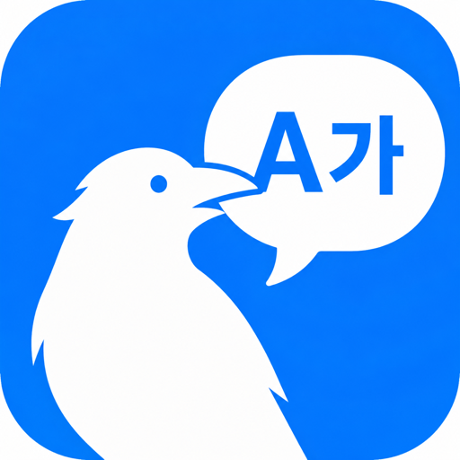

# SwiftyCrow 

[](https://github.com/PangMo5/SwiftyCrow/releases/latest)
[](https://github.com/PangMo5/SwiftyCrow/releases)

[](LICENSE)

On-screen translator for macOS, fully on-device. Captures any region of the screen with [ScreenCaptureKit](https://developer.apple.com/documentation/screencapturekit), recognizes text with [Vision](https://developer.apple.com/documentation/vision), and translates with the [Apple Translation](https://developer.apple.com/documentation/translation) framework — no cloud APIs, no keys, no quotas.


## Features

- **Lives in the menu bar** — no Dock icon; open the popover from the menu bar item, `⌘,` for Settings
- **Region capture** — drag to select any part of the screen; it's translated and shown in a floating preview with each line **blurred** behind its translation. Save the image, copy it, or copy the original / translated text
- **Live overlay** — a floating window you drag and resize over text; flip on **Live mode** to keep translating in place as the content changes
- **Instant re-captures** — translating the same screen again is cached
- **Languages from your Mac** — source/target lists are the languages installed on your system; pick the pair that matches the text
- **Customizable shortcuts** — capture, Live mode, overlay, and the save/copy keys, all in Settings → Shortcuts
- **Editable config file** — a plain-text file you can hand-edit, kept in sync with the in-app Settings

## Install

Requires **macOS 26+**.

**Homebrew** (recommended):

```sh
brew install --cask PangMo5/tap/swiftycrow
```

**Direct download**: grab the latest `.dmg` from the [Releases page](https://github.com/PangMo5/SwiftyCrow/releases/latest), open it, and drag the app to Applications.

On first launch, grant **Screen Recording** permission in System Settings → Privacy & Security, then relaunch the app. The app keeps itself up to date afterward.

## Usage

1. Pick the **Source** and **Target** languages in Settings (`⌘,`).
2. **Capture a region**: trigger **Capture Region** (the popover button or your hotkey), then drag over the text. A floating preview window shows the translation over the screenshot — `⌘S` save, `⌘C` copy image, `⌘O` copy original, `⌘T` copy translation, `Esc` to close.
3. **Or use the live overlay**: drag/resize the floating overlay over text and flip **Live** to keep translating in place; `⌘C` copies the joined translation.

All hotkeys are customizable in Settings → Shortcuts.

## Configuration

All persisted settings live in a single TOML file:

```sh
${XDG_CONFIG_HOME:-$HOME/.config}/SwiftyCrow/config.toml
```

The file is written by the app and can also be edited by hand — changes are picked up on next launch. Settings are grouped into sections that mirror the in-app Settings tabs:

```toml
[capture]
interval = 0.8                      # Live Mode re-capture interval (seconds)

[languages]
[languages.source]
code = "en-US"
[languages.target]
code = "ko-KR"

[overlay]
enabled = true
hideOnHover = false

[recognition]
mode = "text"                       # "text" or "document"

[shortcuts]
selectRegion = "cmd + shift - c"    # skhd-style; omit a key to leave it unset
toggleLive = "cmd + shift - l"
toggleOverlay = "cmd + shift - o"

[translation]
strategy = "lowLatency"             # or "highFidelity" (macOS 26.4+)

[updates]
automaticChecks = true
checkInterval = "daily"             # "hourly", "daily", or "weekly"
```

Window position/size is UI state, so it lives in `~/Library/Application Support/SwiftyCrow/overlay-frame.json`, not here. The capture-window Save/Copy keys are stored by macOS (set them in Settings → Shortcuts), also not in this file.

## Development

### Requirements

- macOS 26+
- Xcode 26+ / Swift 6.3+
- [mise](https://mise.jdx.dev) (manages Tuist + SwiftFormat versions via `.mise.toml`)

### Building from source

```sh
export TUIST_DEVELOPMENT_TEAM=YOUR_TEAM_ID   # your Apple Developer Team ID
mise install               # installs Tuist + SwiftFormat
tuist install              # resolves SPM dependencies
tuist generate             # generates the Xcode workspace
open SwiftyCrow.xcworkspace
```

`TUIST_DEVELOPMENT_TEAM` makes the Debug build sign with the same Apple
Development certificate every time. Skip it and macOS will treat each build
as a new binary and re-prompt for Screen Recording permission on every
launch. Persist it in your shell profile or in `~/.mise.local.toml`:

```toml
[env]
TUIST_DEVELOPMENT_TEAM     = "YOUR_TEAM_ID"
TUIST_SPARKLE_PUBLIC_ED_KEY = "YOUR_SPARKLE_PUBLIC_KEY"
```

`SPARKLE_PUBLIC_ED_KEY` is baked into `Info.plist` at generate time so the
app can verify update signatures. For local debug builds it can be empty.

### Tech stack

- **Tuist** generated workspace (`Project.swift`, `Tuist/Package.swift`)
- **TCA** (`swift-composable-architecture`) for app + capture state; dependencies wired with `@DependencyClient`
- **swift-sharing** with a `fileStorage` strategy bridged to **swift-toml**
- **KeyboardShortcuts** by sindresorhus for global hotkeys
- **Sparkle** for in-app updates
- **Apple Vision** for OCR, **Apple Translation** for translation, **ScreenCaptureKit** for capture
- Source style enforced by the [Airbnb SwiftFormat](https://github.com/airbnb/swift) configuration in `.swiftformat`

## License

[Mozilla Public License 2.0](LICENSE). Originally MIT (2021); relicensed to MPL-2.0 in 2026.

MPL-2.0 is file-level copyleft: modifications to existing source files must remain under MPL-2.0, but you can add new files under any compatible license. App Store distribution is supported.

## Credits

### App Icon
- Rendered with ChatGPT Image, 2026
