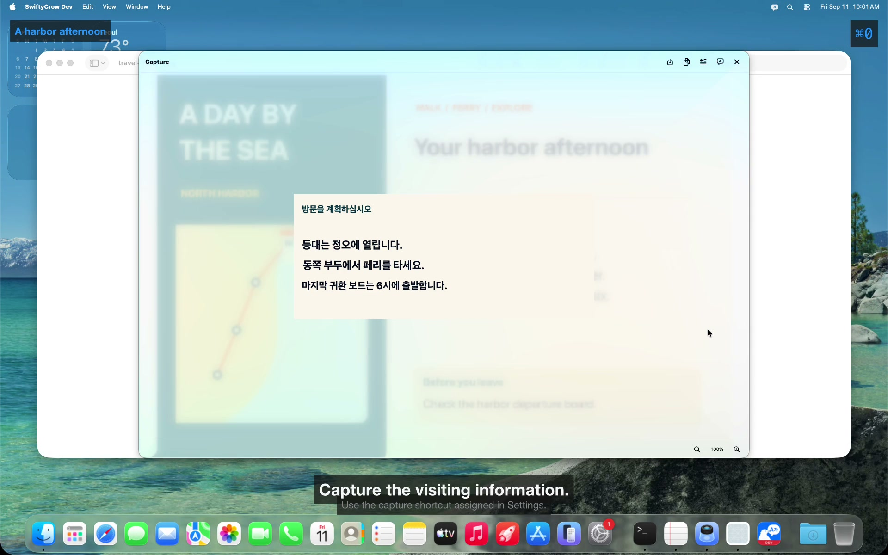
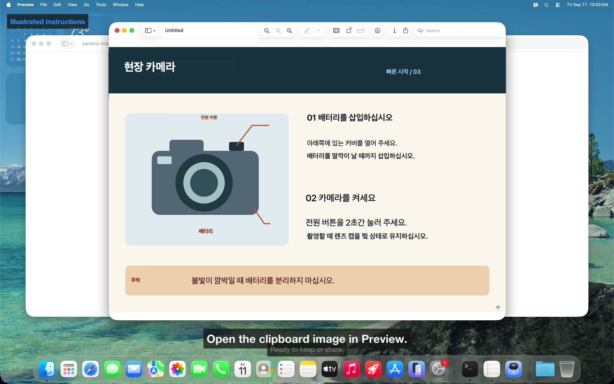
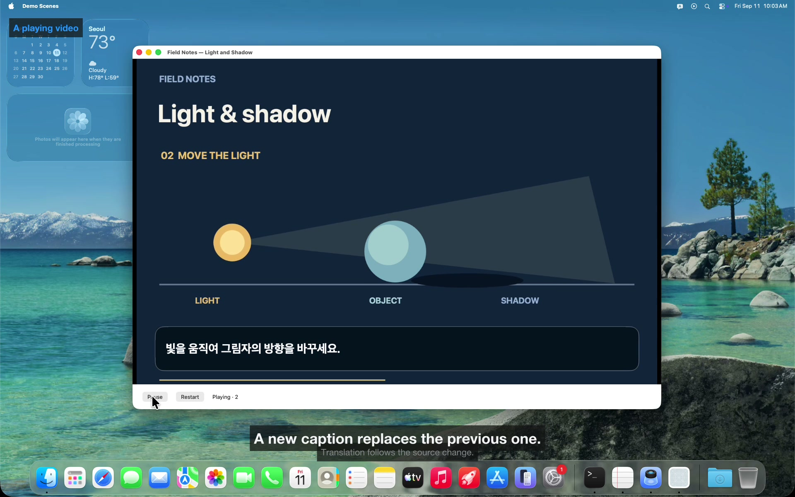
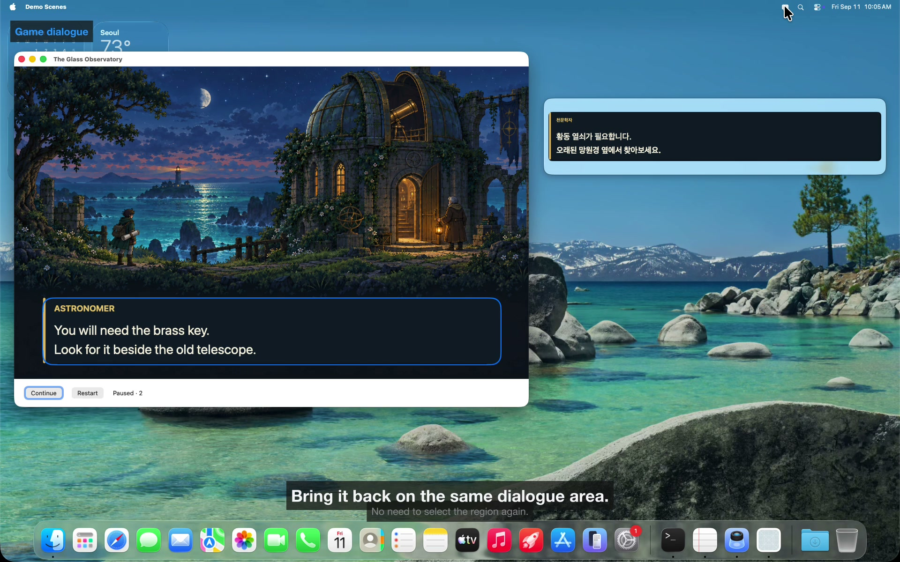
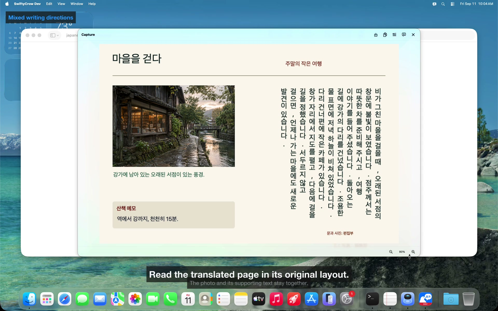

<!-- LANGUAGE-LINKS:START -->
[English](README.md) · [한국어](docs/ko/README.md) · [日本語](docs/ja/README.md) · [简体中文](docs/zh-Hans/README.md) · [繁體中文](docs/zh-Hant/README.md)
<!-- LANGUAGE-LINKS:END -->

<!--
SPDX-FileCopyrightText: 2021-2026 PangMo5 and contributors
SPDX-License-Identifier: MPL-2.0 OR AGPL-3.0-only
-->

# SwiftyCrow 

[](https://github.com/PangMo5/SwiftyCrow/releases/latest)
[](https://github.com/PangMo5/SwiftyCrow/releases)

[](LICENSE)

A fully on-device screen translator for macOS.

SwiftyCrow recognizes and translates text in a selected screen region or window. Capture a still image to read and reuse its translation, or keep a live region translating as its contents change. Recognition and translation use the language models on your Mac; no cloud API or account is required.

## See SwiftyCrow in action

[](https://swiftycrow.pangmo5.dev/#demo-tour)

The overview shows how to capture screen text, translate it, and copy the result into a note. The feature videos below demonstrate examples of image copying, live updates, a separate translation window, and vertical text recognition.

## Why SwiftyCrow?

Text on a webpage, in an image, or inside an app isn't always easy to select and copy. SwiftyCrow reads it from the screen so you can translate it while keeping the source application in view.

- **Translate from the screen:** Select the relevant area without first saving a file or moving its text into another app.
- **Choose the right mode:** Use capture to translate the screen once, or live translation to keep reading as the text changes.
- **Reuse the result:** Save or copy a translated image, or copy only the original or translated text.

## Features

### Capture and reuse

<a href="https://swiftycrow.pangmo5.dev/#demo-capture"></a>

- **Region or window:** Drag a screen region, or press **Space** to highlight and select a whole window.
- **Captured-image translation:** Read translated text in a separate capture result window with the image and its layout retained.
- **Zoom and fit:** Magnify the image or fit it to the result window. At 100%, one captured pixel maps to one display pixel.
- **Save and copy:** Save a PNG, copy the translated image, or copy the recognized original or translation as text. Image output keeps the full capture resolution regardless of zoom or pan.

<br clear="right" />

### Follow changing content

<a href="https://swiftycrow.pangmo5.dev/#demo-live"></a>

- **Continuous translation:** Select a region or window once. New text in that area is recognized and translated as it changes.
- **Source interaction:** Clicks and scrolling in the content area pass through to the application below.
- **Pause and resume:** Use the **LIVE** handle to pause or resume, and **×** to close the overlay.
- **Remembered region:** Show or hide translation over the last region without selecting it again. Hiding stops capture and translation; previous translations can be reused when revisiting text.

<br clear="right" />

#### Keep the original in view

<a href="https://swiftycrow.pangmo5.dev/#demo-compare"></a>

- **Display modes:** Place translation over the source or in a separate window beside it.
- **Separate window:** Read translations beside the source app without covering its content. As the text changes, the same translation window updates.

<br clear="right" />

### Read images and documents

<a href="https://swiftycrow.pangmo5.dev/#demo-layout"></a>

- **Reading order:** Recognize vertical Japanese or Chinese and multi-column text in reading order.
- **Document structure:** Recognize headings, body text, captions, and inset text within the captured page.
- **Original text:** Copy the recognized text for notes or further use without transcribing it by hand.

<br clear="right" />

### Languages and translation

- **Languages from your Mac:** Source and target lists come from the languages supported by macOS. Download the models you need before translating. Pick a pair, or set the source to **Auto** for per-line detection on mixed-language screens.
- **Two translation modes:** Choose **Low latency** for speed or **High fidelity** for Apple Intelligence where supported on macOS 26.4 and later.

### Interface and settings

- **Menu bar controls:** Start capture or live translation from the menu bar and configure their shortcuts in Settings.
- **Launch and updates:** Enable launch at login and configure automatic update checks.
- **Configuration file:** In-app settings and the TOML configuration file stay synchronized.

## Install

Requires **macOS 26+**.

**Homebrew** (recommended):

```sh
brew install --cask PangMo5/tap/swiftycrow
```

**Direct download**: grab the latest `.dmg` from the [Releases page](https://github.com/PangMo5/SwiftyCrow/releases/latest), open it, and drag the app to Applications. Each release also links its exact corresponding source archive.

Quick Setup guides first-time users through screen access, language downloads, and their first capture. Your step and selected language are saved before opening System Settings, so setup resumes if macOS quits and reopens the app. Permission status is also available in Settings → General → Permissions.

## Usage

1. Pick the **Source** and **Target** languages in Settings (`⌘,`).
2. **Capture a region:** Trigger **Capture translation** from the popover or your hotkey, then drag over the text. You can also press **Space** to highlight and click a whole window. Drag the preview’s title area to move the window. Use `⌘+` / `⌘−` to zoom and click the percentage or press `⌘0` to fit; 100% maps each image pixel to one display pixel. The preview supports `⌘S` to save, `⌘C` to copy the image, `⌘O` to copy the original, `⌘T` to copy the translation, and `Esc` to close. Save and copy always include the complete image at the original capture resolution, regardless of zoom or pan.
3. **Use live translation:** Click **Live translation** to select a region or window. Click it again to choose a new area. Use the adjacent **Show overlay** switch to show or hide the selected area; it is disabled until an area has been selected. Use **LIVE** on the overlay to pause or resume, `⌘C` to copy the joined translation, and **×** to close.
4. **Show or hide translation:** The **Show overlay** switch shows or hides translation in the selected area. Hiding it stops capture and translation; showing it resumes in the same area.

New installations include ⇧⌘1 for capture and ⇧⌘2 to select a live translation area. Set these during Quick Setup, or change all capture, overlay, and save/copy shortcuts in Settings → Shortcuts.

## Troubleshooting

### "Unable to translate" or a missing-model hint

SwiftyCrow translates with Apple's on-device Translation framework, which needs a language model installed for each language you translate. If translation fails or SwiftyCrow shows a **"Translation model not installed"** hint, the model for the detected language usually is not downloaded yet.

**To install translation models:**

1. Open **System Settings** → **General** → **Language & Region**
2. Scroll down to **Translation Languages…**
3. Click **Download** next to your source *and* target language. With **Auto** source, install every language that might appear in your captures
4. Relaunch SwiftyCrow and try again

The in-app hint has an **Open Settings** button that jumps straight there, plus **Don't show again** once you no longer need the reminder. Models are managed by macOS and stored locally. Remove unused models from the same panel to free disk space.

For more details, see [docs/LANGUAGE_MODELS.md](docs/LANGUAGE_MODELS.md).

## Configuration

Settings live in `~/.config/SwiftyCrow/config.toml`, grouped into tables that
mirror the in-app Settings tabs: `[languages]`, `[overlay]`,
`[shortcuts]`, `[translation]`, and `[updates]`. Edits made in the app or by
hand are kept in sync.

See [docs/CONFIGURATION.md](docs/CONFIGURATION.md) for the full reference:
every key, its default, and the shortcut syntax.

## Development

### Requirements

- Xcode 26.4+ with Swift 6.3 and the macOS 26.4 SDK or newer
- [mise](https://mise.jdx.dev) (manages Tuist via `.mise.toml`)
- SwiftFormat, installed separately, for source formatting

### Building from source

```sh
export TUIST_DEVELOPMENT_TEAM=YOUR_TEAM_ID
export TUIST_SPARKLE_PUBLIC_ED_KEY=YOUR_SPARKLE_PUBLIC_KEY
mise install               # installs Tuist
tuist install              # resolves SPM dependencies
tuist generate             # generates the Xcode workspace
open SwiftyCrow.xcworkspace
```

The project uses Apple Development signing for Debug builds. Set
`TUIST_DEVELOPMENT_TEAM` to the team associated with your development certificate.
Consistent signing lets macOS retain the app's Screen Recording grant across
rebuilds. Persist the values in your shell profile or a local `.mise.local.toml`:

```toml
[env]
TUIST_DEVELOPMENT_TEAM     = "YOUR_TEAM_ID"
TUIST_SPARKLE_PUBLIC_ED_KEY = "YOUR_SPARKLE_PUBLIC_KEY"
```

`TUIST_SPARKLE_PUBLIC_ED_KEY` supplies the public verification key embedded in
`Info.plist` when the project is generated. It must be valid and match the update
feed's signing key. For the official feed, use `SUPublicEDKey` from the released
app's `Contents/Info.plist`. A fork needs its own feed and matching public key.

### Localization and site previews

Follow [docs/LOCALIZATION.md](docs/LOCALIZATION.md) for terminology and writing style. App catalogs, documentation, and websites share five locales. Generated language files are checked against their catalogs before every app build.

```sh
swift run --package-path Tools swiftycrow-tools check
swift run --package-path Tools swiftycrow-tools docs
swift run --package-path Tools swiftycrow-tools site --output DerivedData/Site
swift run --package-path Tools swiftycrow-tools serve --output DerivedData/Site --port 8085
```

### Tech stack

- **Tuist** generated workspace (`Project.swift`, `Tuist/Package.swift`)
- **TCA** (`swift-composable-architecture`) for app + capture state, with dependencies wired through `@DependencyClient`
- **swift-sharing** with a `fileStorage` strategy bridged to **swift-toml**
- **Magnet** for global hotkey registration, plus a small custom recorder view
- **Sparkle** for in-app updates
- **Apple Vision** for OCR, **Apple Translation** for translation, **ScreenCaptureKit** for capture
- Source style enforced by the [Airbnb SwiftFormat](https://github.com/airbnb/swift) configuration in `.swiftformat`

## License

[GNU Affero General Public License v3.0 only](LICENSE) (`AGPL-3.0-only`). Copyright (C) 2021-2026 PangMo5.

If you distribute a modified version, you must make its corresponding source available under the same license. Section 13 also requires modified versions used over a network to offer their corresponding source to remote users.

This README and `docs/LANGUAGE_MODELS.md` contain earlier documentation contributions made under MPL-2.0 and remain available under either [MPL-2.0](https://www.mozilla.org/MPL/2.0/) or AGPL-3.0-only, as indicated in those files. The project was originally MIT-licensed in 2021 and moved to MPL-2.0, then AGPL-3.0-only, in 2026.

Licenses and exact source revisions for incorporated packages are recorded in [THIRD_PARTY_NOTICES.md](THIRD_PARTY_NOTICES.md). Both that file and this license are included in the distributed app bundle.
