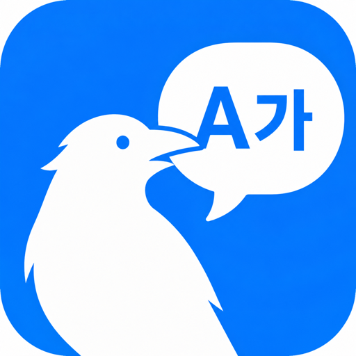

<!--
SPDX-FileCopyrightText: 2021-2026 PangMo5 and contributors
SPDX-License-Identifier: MPL-2.0 OR AGPL-3.0-only
-->

# SwiftyCrow 

[](https://github.com/PangMo5/SwiftyCrow/releases/latest)
[](https://github.com/PangMo5/SwiftyCrow/releases)

[](LICENSE)

On-screen translator for macOS, fully on-device. Captures any region of the screen with [ScreenCaptureKit](https://developer.apple.com/documentation/screencapturekit), recognizes text with [Vision](https://developer.apple.com/documentation/vision), and translates with the [Apple Translation](https://developer.apple.com/documentation/translation) framework. No cloud APIs, no keys, no quotas.


## Features

- **Lives in the menu bar:** There is no Dock icon. Open the popover from the menu bar item, or press `⌘,` for Settings.
- **Region capture:** Drag to select any part of the screen, or press **Space** to highlight and click a whole window like the macOS screenshot tool. The result appears in a floating preview with each line **blurred** behind its translation. Save the image, copy it, or copy the original or translated text.
- **Live overlay:** Pick a target the same way and an overlay snaps onto it, translating as the content changes. Clicks and scrolling pass through to the app underneath. The built-in **LIVE** handle pauses or resumes translation, and **×** closes it. Show the translation **in place** over the source, or in a separate **window** while the overlay stays a thin region frame.
- **Predefine an area, translate on demand:** The overlay remembers its region, so **Show / hide overlay** flips translation on and off over the same spot without another selection. This works well for a game panel or fixed HUD. Hiding it stops all capture and translation until you bring it back.
- **Reads the layout:** Recognition follows document structure. Vertical Japanese or Chinese and multi-column text are read in reading order, and vertical text stays vertical over the original.
- **Instant re-captures:** Translating the same screen again uses cached results.
- **Languages from your Mac:** Source and target lists come from the languages installed on your system. Pick a pair, or set the source to **Auto** for per-line detection on mixed-language screens.
- **Two translation modes:** Choose **Low latency** for speed or **High fidelity** for Apple Intelligence where supported on macOS 26.4 and later.
- **Customizable shortcuts:** Configure capture, live overlay, show or hide on the last region, pause or resume Live, display mode, and save or copy keys in Settings → Shortcuts.
- **Launch at login:** Start SwiftyCrow automatically when you log in.
- **Editable config file:** Hand-edit a plain-text file that stays synchronized with the in-app Settings.

## Install

Requires **macOS 26+**.

**Homebrew** (recommended):

```sh
brew install --cask PangMo5/tap/swiftycrow
```

**Direct download**: grab the latest `.dmg` from the [Releases page](https://github.com/PangMo5/SwiftyCrow/releases/latest), open it, and drag the app to Applications. Each release also links its exact corresponding source archive.

On first launch, grant **Screen Recording** permission in System Settings → Privacy & Security, then relaunch the app. The app keeps itself up to date afterward.

## Usage

1. Pick the **Source** and **Target** languages in Settings (`⌘,`).
2. **Capture a region:** Trigger **Capture Region** from the popover or your hotkey, then drag over the text. You can also press **Space** to highlight and click a whole window. The preview supports `⌘S` to save, `⌘C` to copy the image, `⌘O` to copy the original, `⌘T` to copy the translation, and `Esc` to close.
3. **Use the live overlay:** Trigger **Live overlay…** from the menu bar or your hotkey, then drag a region or press **Space** to click a window. Use the **LIVE** handle to pause or resume, `⌘C` to copy the joined translation, and **×** to close.
4. **Reuse a fixed area:** Once the overlay is placed, **Show / hide overlay** toggles it over the same region without another drag. Hiding it stops all capture and translation.

All hotkeys are customizable in Settings → Shortcuts.

## Troubleshooting

### "Unable to translate" or a missing-model hint

SwiftyCrow translates with Apple's on-device Translation framework, which needs a language model installed for each language you translate. If translation fails or SwiftyCrow shows a **"Translation model not installed"** hint, the model for the detected language usually is not downloaded yet.

**To install translation models:**

1. Open **System Settings** → **General** → **Language & Region**
2. Scroll down to **Translation Languages…**
3. Click **Download** next to your source *and* target language (1–3 GB each). With **Auto** source, install every language that might appear in your captures
4. Relaunch SwiftyCrow and try again

The in-app hint has an **Open Settings** button that jumps straight there, plus **Don't show again** once you no longer need the reminder. Models are managed by macOS and stored locally. Remove unused models from the same panel to free disk space.

For more details, see [docs/LANGUAGE_MODELS.md](docs/LANGUAGE_MODELS.md).

## Configuration

Settings live in `~/.config/SwiftyCrow/config.toml`, grouped into tables that
mirror the in-app Settings tabs: `[languages]`, `[overlay]`,
`[shortcuts]`, `[translation]`, and `[updates]`. Edits made in the app or by
hand are kept in sync.

See [docs/CONFIGURATION.md](docs/CONFIGURATION.md) for the full reference:
every key, its default, and the shortcut syntax.

## Development

### Requirements

- macOS 26+
- Xcode 26+ / Swift 6.3+
- [mise](https://mise.jdx.dev) (manages Tuist + SwiftFormat versions via `.mise.toml`)

### Building from source

```sh
export TUIST_DEVELOPMENT_TEAM=YOUR_TEAM_ID   # your Apple Developer Team ID
mise install               # installs Tuist + SwiftFormat
tuist install              # resolves SPM dependencies
tuist generate             # generates the Xcode workspace
open SwiftyCrow.xcworkspace
```

`TUIST_DEVELOPMENT_TEAM` makes the Debug build sign with the same Apple
Development certificate every time. Skip it and macOS will treat each build
as a new binary and re-prompt for Screen Recording permission on every
launch. Persist it in your shell profile or in `~/.mise.local.toml`:

```toml
[env]
TUIST_DEVELOPMENT_TEAM     = "YOUR_TEAM_ID"
TUIST_SPARKLE_PUBLIC_ED_KEY = "YOUR_SPARKLE_PUBLIC_KEY"
```

`SPARKLE_PUBLIC_ED_KEY` is baked into `Info.plist` at generate time so the
app can verify update signatures. For local debug builds it can be empty.

### Tech stack

- **Tuist** generated workspace (`Project.swift`, `Tuist/Package.swift`)
- **TCA** (`swift-composable-architecture`) for app + capture state, with dependencies wired through `@DependencyClient`
- **swift-sharing** with a `fileStorage` strategy bridged to **swift-toml**
- **Magnet** for global hotkey registration, plus a small custom recorder view
- **Sparkle** for in-app updates
- **Apple Vision** for OCR, **Apple Translation** for translation, **ScreenCaptureKit** for capture
- Source style enforced by the [Airbnb SwiftFormat](https://github.com/airbnb/swift) configuration in `.swiftformat`

## License

[GNU Affero General Public License v3.0 only](LICENSE) (`AGPL-3.0-only`). Copyright (C) 2021-2026 PangMo5.

If you distribute a modified version, you must make its corresponding source available under the same license. Section 13 also requires modified versions used over a network to offer their corresponding source to remote users.

This README and `docs/LANGUAGE_MODELS.md` contain earlier documentation contributions made under MPL-2.0 and remain available under either [MPL-2.0](https://www.mozilla.org/MPL/2.0/) or AGPL-3.0-only, as indicated in those files. The project was originally MIT-licensed in 2021 and moved to MPL-2.0, then AGPL-3.0-only, in 2026.

Licenses and exact source revisions for incorporated packages are recorded in [THIRD_PARTY_NOTICES.md](THIRD_PARTY_NOTICES.md). Both that file and this license are included in the distributed app bundle.
