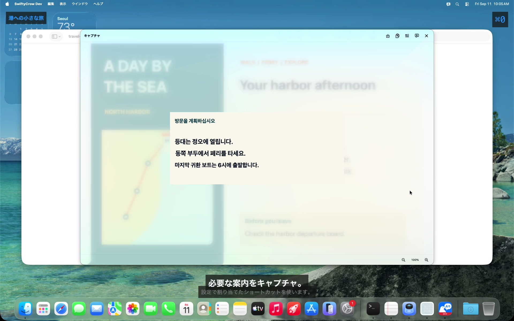
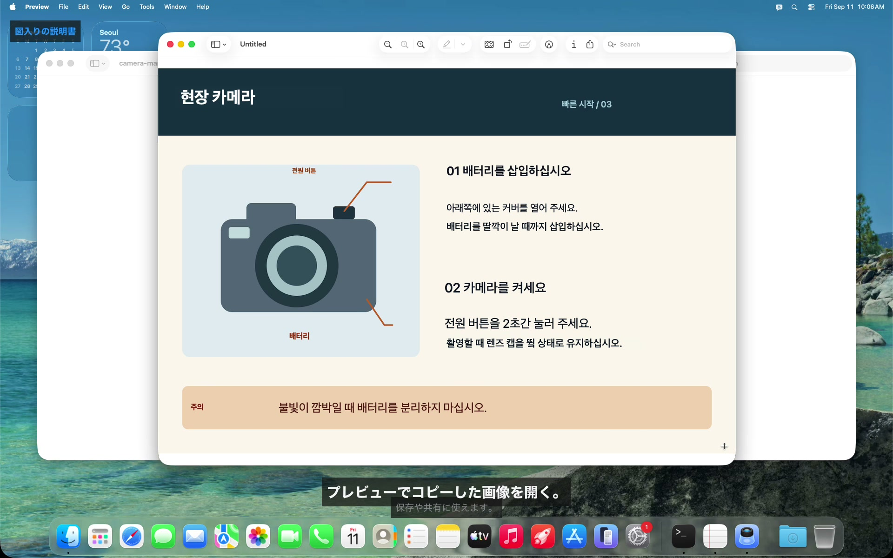
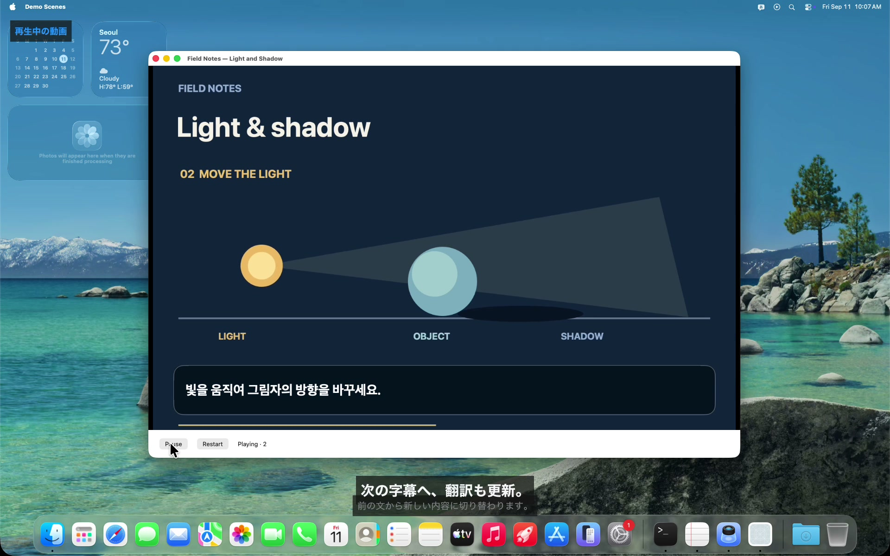
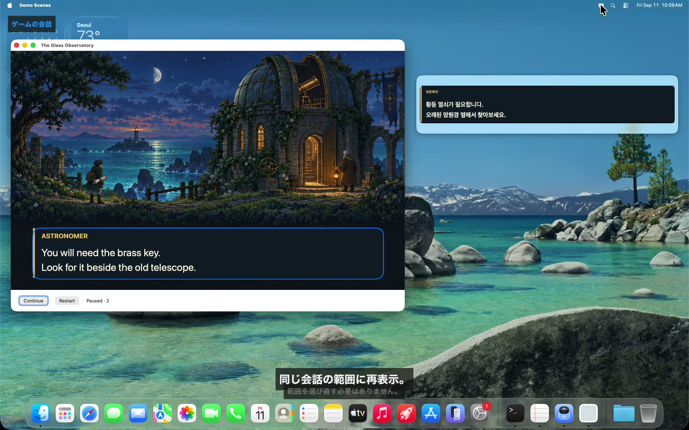
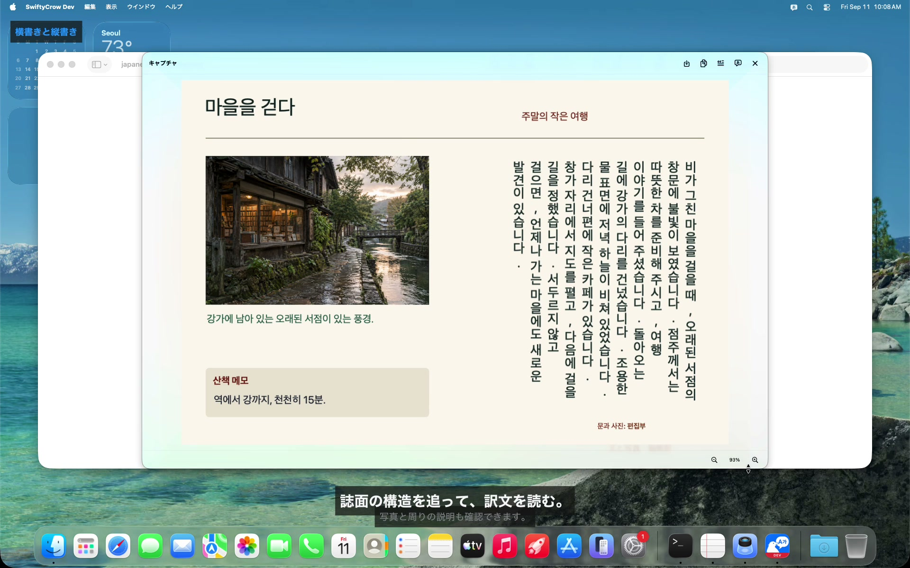

<!-- LANGUAGE-LINKS:START -->
[English](../../README.md) · [한국어](../ko/README.md) · [日本語](README.md) · [简体中文](../zh-Hans/README.md) · [繁體中文](../zh-Hant/README.md)
<!-- LANGUAGE-LINKS:END -->

<!--
SPDX-FileCopyrightText: 2021-2026 PangMo5 and contributors
SPDX-License-Identifier: MPL-2.0 OR AGPL-3.0-only
-->

<a id="swiftycrow"></a>
# SwiftyCrow 

[](https://github.com/PangMo5/SwiftyCrow/releases/latest) [](https://github.com/PangMo5/SwiftyCrow/releases)  [](../../LICENSE)

すべての翻訳をMac内で処理する、macOS用の画面翻訳アプリです。

SwiftyCrowは、選んだ画面範囲やウインドウの文字を認識して翻訳します。静止画をキャプチャして翻訳を読み、活用したり、内容が変わる範囲をライブ翻訳で読み続けたりできます。認識と翻訳にはMac内の言語モデルを使用し、クラウドAPIやアカウントは不要です。

<a id="see-swiftycrow-in-action"></a>
## SwiftyCrow の使い方

[](https://swiftycrow.pangmo5.dev/ja/#demo-tour)

概要動画では、画面の文字をキャプチャして翻訳し、メモにコピーする流れを紹介します。下の機能別動画では、画像のコピー、ライブ更新、別の翻訳ウインドウ、縦書き認識の活用例をご覧いただけます。

<a id="why-swiftycrow"></a>
## SwiftyCrowを使う理由

ウェブページや画像、アプリ画面の文字は、選択やコピーが難しいことがあります。SwiftyCrowは画面から文字を読み取り、元のアプリを見たまま翻訳できます。

- **画面から翻訳：** ファイルを保存したり、文字をほかのアプリへ移したりする前に、必要な範囲を選んで翻訳できます。
- **用途に合ったモード：** 一度だけ翻訳して読むならキャプチャ、文字の変化を読み続けるならライブ翻訳を使います。
- **結果を活用：** 翻訳した画像を保存・コピーしたり、原文や訳文だけを文字としてコピーしたりできます。

<a id="features"></a>
## 主な機能

<a id="capture-and-reuse"></a>
### キャプチャした内容を活用

<a href="https://swiftycrow.pangmo5.dev/ja/#demo-capture"></a>

- **範囲やウインドウを選択：** 画面の範囲をドラッグするか、**Space**キーでウインドウ全体をハイライトして選択できます。
- **キャプチャ画像を翻訳：** 画像とレイアウトを保った別の結果ウインドウで訳文を読めます。
- **拡大・縮小とウインドウに合わせる：** 画像を拡大したり、結果ウインドウに合わせたりできます。100%では、キャプチャした1ピクセルが画面上の1ピクセルに対応します。
- **保存とコピー：** PNGの保存、翻訳済み画像のコピー、認識した原文や訳文のテキストコピーに対応。画像は拡大率や移動位置に関係なく、キャプチャ時の全解像度で出力されます。

<br clear="right" />

<a id="follow-changing-content"></a>
### 変わる内容を読み続ける

<a href="https://swiftycrow.pangmo5.dev/ja/#demo-live"></a>

- **継続して翻訳：** 範囲やウインドウを一度選ぶと、その中の文字が変わるたびに認識して翻訳します。
- **元のアプリを操作：** 本文部分のクリックやスクロールは、背後のアプリにそのまま届きます。
- **一時停止と再開：** **ライブ**ボタンで翻訳を一時停止・再開し、**×**でオーバーレイを閉じます。
- **範囲を記憶：** 前回の範囲を選び直さずに翻訳を表示・非表示にできます。非表示にするとキャプチャと翻訳は停止し、同じ文章に戻ると以前の翻訳を再利用できます。

<br clear="right" />

<a id="keep-the-original-in-view"></a>
#### 原文も見ながら読む

<a href="https://swiftycrow.pangmo5.dev/ja/#demo-compare"></a>

- **表示方法：** 原文の上に翻訳を重ねるか、隣の別ウインドウで読めます。
- **別の翻訳ウインドウ：** 元のアプリを隠さずに、その隣で訳文を読めます。文字が変わると同じ翻訳ウインドウが更新されます。

<br clear="right" />

<a id="read-images-and-documents"></a>
### 画像や文書を読む

<a href="https://swiftycrow.pangmo5.dev/ja/#demo-layout"></a>

- **読む順番を認識：** 縦書きの日本語・中国語や段組みの文章を、読む順番に沿って認識します。
- **文書の構造：** キャプチャしたページの見出し、本文、写真の説明、囲み記事を認識します。
- **原文の文字：** 読み取った文字を手入力で書き写すことなく、メモやほかの用途にコピーできます。

<br clear="right" />

<a id="languages-and-translation"></a>
### 言語と翻訳

- **Macが対応する言語：** macOSが対応する原文・翻訳先の言語を選べます。翻訳前に必要なモデルをダウンロードしてください。原文を**自動検出**にすると、複数の言語が混在する画面でも行ごとに検出します。
- **2つの翻訳方式：** 速さを優先するなら**速度優先**、対応デバイスのmacOS 26.4以降でApple Intelligenceを使うなら**品質優先**を選べます。

<a id="interface-and-settings"></a>
### インターフェイスと設定

- **メニューバーから操作：** キャプチャやライブ翻訳をメニューバーから開始し、設定でショートカットを変更できます。
- **起動とアップデート：** ログイン時の起動や自動アップデート確認を設定できます。
- **設定ファイル：** アプリ内の設定とTOML設定ファイルは同期されます。

<a id="install"></a>
## インストール

**macOS 26以降**が必要です。

**Homebrew**（推奨）：

```sh
brew install --cask PangMo5/tap/swiftycrow
```

**直接ダウンロード：** [リリースページ](https://github.com/PangMo5/SwiftyCrow/releases/latest)から最新の`.dmg`をダウンロードして開き、アプリをアプリケーションフォルダに移動してください。各リリースには、そのバージョンに対応するソースアーカイブへのリンクもあります。

初回起動時はクイック設定で、画面収録の許可、言語のダウンロード、最初のキャプチャを案内します。システム設定を開く前に手順と選んだ言語を保存するので、macOSがアプリを終了して開き直しても続きから進められます。設定 → 一般 → アクセス権でも状態を確認できます。

<a id="usage"></a>
## 使い方

1. 設定（`⌘,`）で**原文の言語**と**翻訳先の言語**を選んでください。
2. **範囲をキャプチャ：** ポップオーバーやショートカットで**キャプチャ翻訳**を開始し、文字の上をドラッグします。**Space**キーでウインドウ全体をハイライトし、クリックして選ぶこともできます。結果ウインドウはタイトル部分をドラッグして移動できます。`⌘+` / `⌘−`で拡大・縮小し、倍率をクリックするか`⌘0`でウインドウに合わせます。100%では画像の1ピクセルが画面の1ピクセルに対応します。`⌘S`で保存、`⌘C`で画像をコピー、`⌘O`で原文をコピー、`⌘T`で訳文をコピー、`Esc`で閉じます。保存・コピーには拡大率や移動位置に関係なく、元の解像度の画像全体が含まれます。
3. **ライブ翻訳を使う：** **ライブ翻訳**ボタンで範囲やウインドウを選びます。もう一度クリックすると新しい範囲を選べます。隣の**オーバーレイを表示**スイッチで選んだ範囲の翻訳を切り替えます。範囲を選ぶまでは無効です。オーバーレイの**ライブ**で一時停止・再開し、`⌘C`で訳文全体をコピー、**×**で閉じます。
4. **翻訳を表示・非表示：** **オーバーレイを表示**スイッチで、選んだ範囲の翻訳を切り替えます。非表示にするとキャプチャと翻訳を停止し、再表示すると同じ範囲で再開します。

新規インストールでは、⇧⌘1でキャプチャ、⇧⌘2でライブ翻訳の範囲を選択にできます。クイック設定で設定するか、設定 → ショートカットでキャプチャ、オーバーレイ、保存・コピーのキーを変更できます。

<a id="troubleshooting"></a>
## トラブルシューティング

<a id="unable-to-translate-or-a-missing-model-hint"></a>
### 翻訳エラーやモデル未インストールの案内

SwiftyCrowは、翻訳する言語のモデルが必要なAppleのオンデバイス翻訳を使っています。翻訳に失敗したり、**言語モデルがインストールされていないという案内**が表示された場合は、検出した言語のモデルがまだダウンロードされていない可能性があります。

**翻訳モデルをインストールするには：**

1. **システム設定** → **一般** → **言語と地域**を開いてください。
2. 下にスクロールして**翻訳言語…**を選んでください。
3. 原文と翻訳先の**両方**の言語で**ダウンロード**を押してください。原文が**自動検出**の場合は、キャプチャに含まれそうな言語をすべてインストールしてください。
4. SwiftyCrowを再起動して、もう一度お試しください。

アプリの**設定を開く**ボタンから該当する設定に移動できます。案内が不要になったら**今後表示しない**を選べます。モデルはmacOSが管理し、Mac内に保存されます。同じ設定から使わないモデルを削除して空き容量を増やせます。

詳しくは[docs/LANGUAGE_MODELS.md](LANGUAGE_MODELS.md)をご覧ください。

<a id="configuration"></a>
## 設定

設定は`~/.config/SwiftyCrow/config.toml`に保存されます。アプリの設定タブに対応する`[languages]`、`[overlay]`、`[shortcuts]`、`[translation]`、`[updates]`のテーブルに分かれ、アプリ内の変更とファイルの直接編集が相互に同期します。

すべてのキー、初期値、ショートカットの書式は[docs/CONFIGURATION.md](CONFIGURATION.md)で確認できます。

<a id="development"></a>
## 開発

<a id="requirements"></a>
### 必要な環境

- Swift 6.3とmacOS 26.4 SDK以降を含むXcode 26.4以降
- [mise](https://mise.jdx.dev)（`.mise.toml`でTuistを管理）
- ソースコードの書式を整えるSwiftFormatを別途インストール

<a id="building-from-source"></a>
### ソースからビルド

```sh
export TUIST_DEVELOPMENT_TEAM=YOUR_TEAM_ID
export TUIST_SPARKLE_PUBLIC_ED_KEY=YOUR_SPARKLE_PUBLIC_KEY
mise install               # installs Tuist
tuist install              # resolves SPM dependencies
tuist generate             # generates the Xcode workspace
open SwiftyCrow.xcworkspace
```

DebugビルドはApple Development証明書で署名します。`TUIST_DEVELOPMENT_TEAM`には開発証明書に対応するチームを指定してください。同じ署名を使い続けると、再ビルド後もmacOSが画面収録の許可を維持できます。値はシェルのプロファイルかローカルの`.mise.local.toml`に保存してください。

```toml
[env]
TUIST_DEVELOPMENT_TEAM     = "YOUR_TEAM_ID"
TUIST_SPARKLE_PUBLIC_ED_KEY = "YOUR_SPARKLE_PUBLIC_KEY"
```

`TUIST_SPARKLE_PUBLIC_ED_KEY`は、プロジェクト生成時に`Info.plist`へ埋め込む公開検証キーです。有効なキーで、更新フィードの署名キーと一致する必要があります。公式フィードを使う場合は、リリース済みアプリの`Contents/Info.plist`にある`SUPublicEDKey`を使ってください。フォークには独自のフィードと対応する公開キーが必要です。

<a id="localization-and-site-previews"></a>
### ローカライズとサイトのプレビュー

用語と文体は[docs/LOCALIZATION.md](../LOCALIZATION.md)に従ってください。アプリのカタログ、文書、ウェブサイトは同じ5言語を使います。アプリのビルド前に、生成した言語ファイルとカタログの一致を確認します。

```sh
swift run --package-path Tools swiftycrow-tools check
swift run --package-path Tools swiftycrow-tools docs
swift run --package-path Tools swiftycrow-tools site --output DerivedData/Site
swift run --package-path Tools swiftycrow-tools serve --output DerivedData/Site --port 8085
```

<a id="tech-stack"></a>
### 技術構成

- **Tuist**で生成するワークスペース（`Project.swift`、`Tuist/Package.swift`）
- アプリとキャプチャの状態は**TCA**（`swift-composable-architecture`）で管理し、依存関係は`@DependencyClient`で接続します。
- **swift-sharing**の`fileStorage`を**swift-toml**に接続しています。
- グローバルショートカットの登録には**Magnet**を使い、小さな独自の記録欄を用意しています。
- アプリ内の更新には**Sparkle**を使います。
- 文字認識には**Apple Vision**、翻訳には**Apple翻訳**、キャプチャには**ScreenCaptureKit**を使います。
- `.swiftformat`にある[Airbnb SwiftFormat](https://github.com/airbnb/swift)設定でソースコードの書式を統一します。

<a id="license"></a>
## ライセンス

[GNU Affero General Public License v3.0 only](../../LICENSE) (`AGPL-3.0-only`). Copyright (C) 2021-2026 PangMo5.

変更したバージョンを配布する場合は、対応するソースコードを同じライセンスで提供する必要があります。第13条では、ネットワーク経由で使われる変更版について、遠隔の利用者にも対応するソースコードを提供することを求めています。

このREADMEと`docs/LANGUAGE_MODELS.md`には、MPL-2.0で提供された以前の文書の寄稿が含まれています。各ファイルの表示どおり、[MPL-2.0](https://www.mozilla.org/MPL/2.0/)またはAGPL-3.0-onlyのどちらかで利用できます。プロジェクトは2021年にMITライセンスで始まり、2026年にMPL-2.0を経てAGPL-3.0-onlyへ移行しました。

利用しているパッケージのライセンスと正確なソースリビジョンは[THIRD_PARTY_NOTICES.md](../../THIRD_PARTY_NOTICES.md)に記録しています。このファイルとライセンスは配布アプリにも含まれます。
