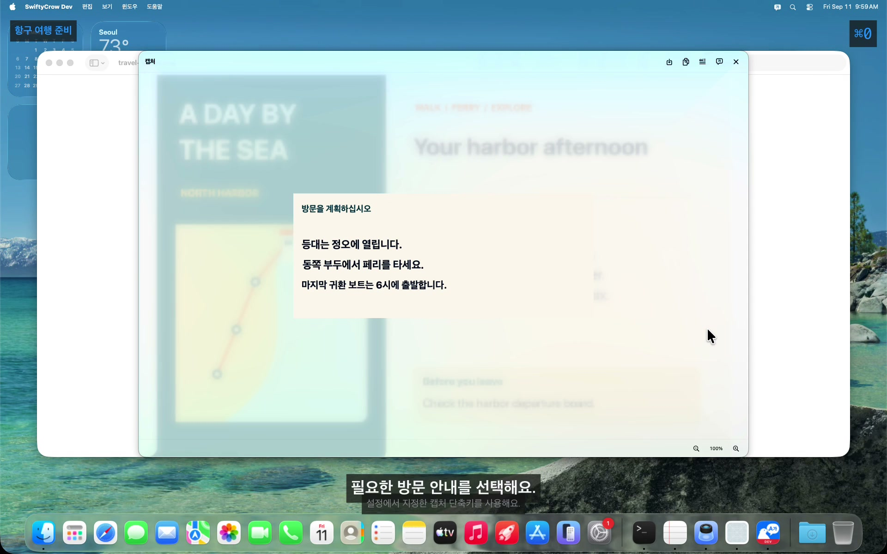
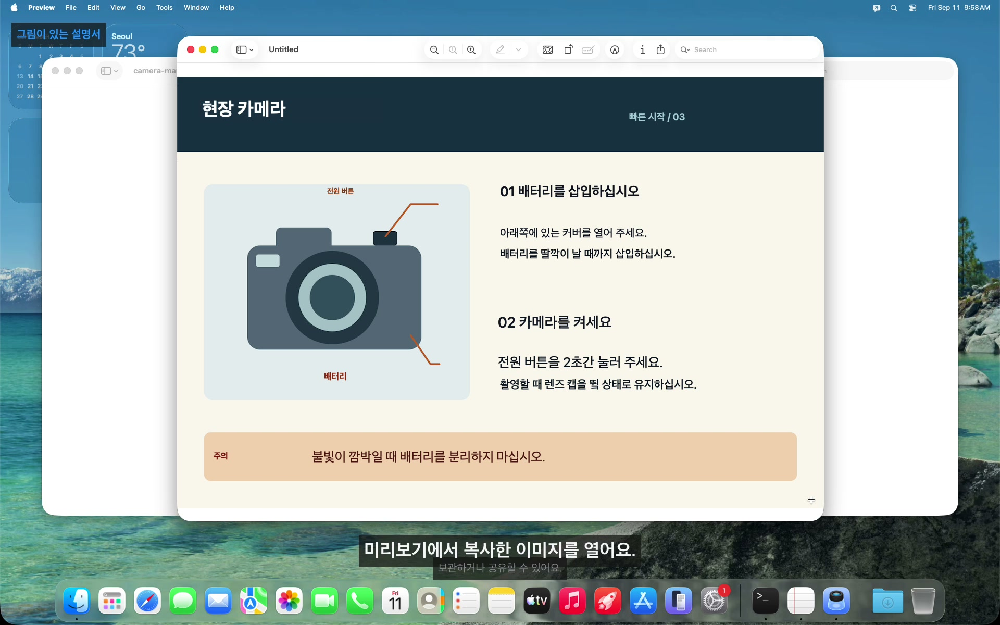
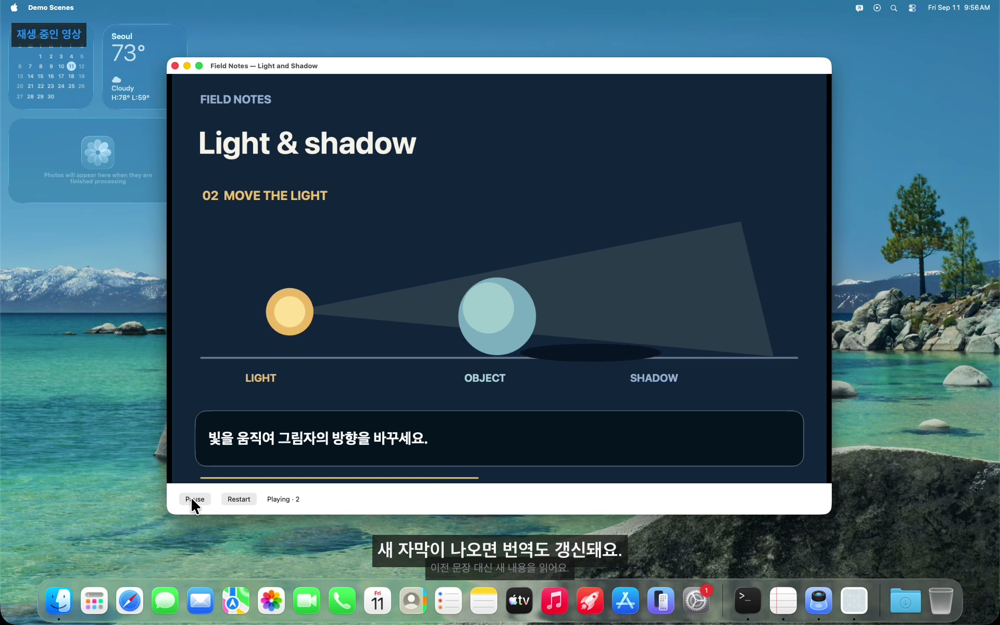
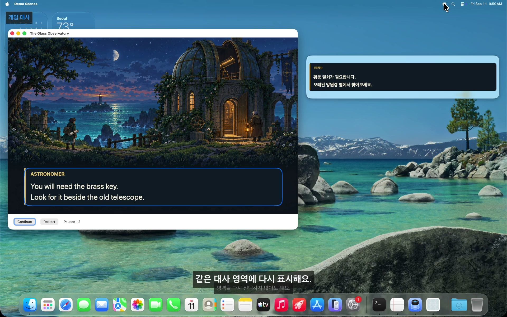
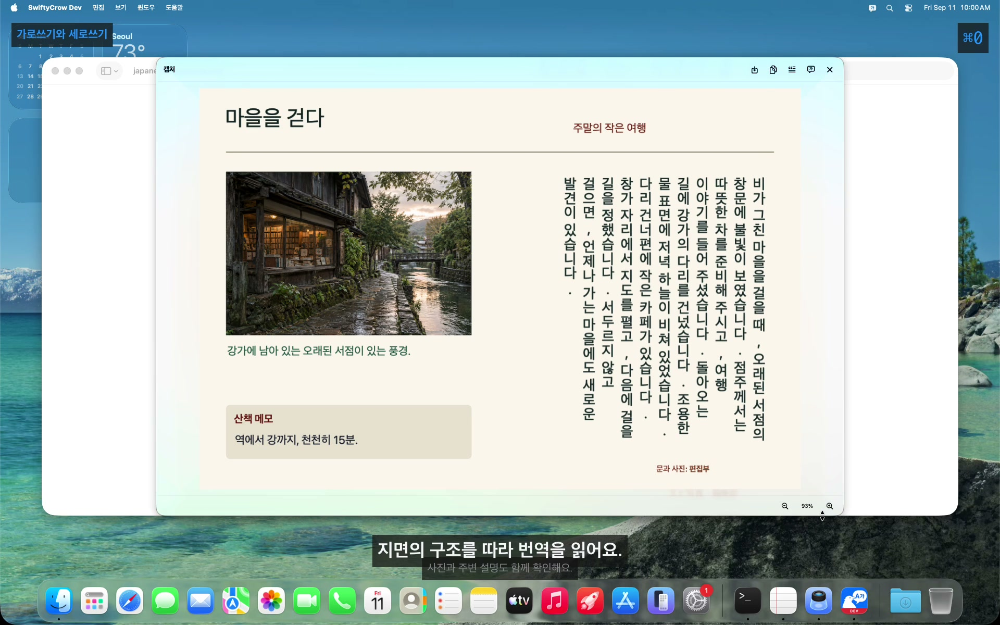

<!-- LANGUAGE-LINKS:START -->
[English](../../README.md) · [한국어](README.md) · [日本語](../ja/README.md) · [简体中文](../zh-Hans/README.md) · [繁體中文](../zh-Hant/README.md)
<!-- LANGUAGE-LINKS:END -->

<!--
SPDX-FileCopyrightText: 2021-2026 PangMo5 and contributors
SPDX-License-Identifier: MPL-2.0 OR AGPL-3.0-only
-->

<a id="swiftycrow"></a>
# SwiftyCrow 

[](https://github.com/PangMo5/SwiftyCrow/releases/latest) [](https://github.com/PangMo5/SwiftyCrow/releases)  [](../../LICENSE)

모든 번역을 Mac 안에서 처리하는 macOS 화면 번역 앱이에요.

SwiftyCrow는 화면에서 선택한 영역이나 창의 글자를 인식하고 번역해요. 캡처한 이미지를 번역해 활용하거나, 지정한 영역의 내용이 바뀔 때마다 실시간으로 번역할 수 있어요. 글자 인식과 번역은 Mac의 언어 모델로 처리하며 클라우드 API나 계정이 필요하지 않아요.

<a id="see-swiftycrow-in-action"></a>
## SwiftyCrow 사용 모습

[](https://swiftycrow.pangmo5.dev/ko/#demo-tour)

대표 영상은 영역 캡처, 번역, 번역문을 메모에 붙여넣는 순서로 구성되어 있어요. 아래 기능별 영상에서는 이미지 복사, 바뀌는 자막, 별도 번역 창, 세로쓰기 인식을 확인할 수 있어요.

<a id="why-swiftycrow"></a>
## 왜 SwiftyCrow인가요?

이미지로 된 설명서, 영상 자막, 게임 대사에는 선택해서 복사하기 어려운 글자가 있어요. SwiftyCrow는 화면에서 글자를 읽어, 사용하던 앱을 보면서 내용을 이해할 수 있게 해요.

- **화면에서 바로 번역:** 파일로 저장하거나 글을 다른 앱에 옮기지 않고 필요한 영역을 선택해요.
- **내용에 맞는 번역 방식:** 한 장의 이미지는 캡처 번역으로, 계속 바뀌는 글은 실시간 번역으로 읽어요.
- **번역 결과 활용:** 번역된 이미지를 저장·복사하거나 원문과 번역문을 글자로 복사할 수 있어요.

<a id="features"></a>
## 주요 기능

<a id="capture-and-reuse"></a>
### 캡처 번역

<a href="https://swiftycrow.pangmo5.dev/ko/#demo-capture"></a>

- **영역·창 선택:** 화면의 원하는 영역을 드래그하거나 **Space**를 눌러 창 전체를 선택해요.
- **캡처 이미지 번역:** 이미지와 배치를 유지한 별도 결과 창에서 번역문을 읽어요.
- **확대·축소와 창 맞춤:** 이미지를 확대하거나 결과 창에 맞춰 볼 수 있어요. 100%에서는 캡처한 픽셀 하나가 화면 픽셀 하나에 대응해요.
- **저장·복사:** PNG 저장, 번역된 이미지 복사, 인식한 원문 또는 번역문 복사를 지원해요. 이미지 저장·복사는 확대율이나 이동 위치와 관계없이 전체 캡처 해상도를 유지해요.

<br clear="right" />

<a id="follow-changing-content"></a>
### 실시간 번역

<a href="https://swiftycrow.pangmo5.dev/ko/#demo-live"></a>

- **자동 갱신:** 영역이나 창을 한 번 지정하면 내용이 바뀔 때마다 새 글자를 인식하고 번역해요.
- **원래 앱 조작:** 본문 영역의 클릭과 스크롤은 뒤쪽 앱으로 전달돼요.
- **일시 정지·재개:** **실시간** 버튼으로 번역을 멈추거나 다시 시작하고, **×**로 닫아요.
- **영역 기억:** 마지막 영역에서 번역을 표시하거나 숨길 수 있어요. 숨기면 캡처와 번역을 멈추며, 같은 글을 다시 볼 때 이전 번역을 재사용할 수 있어요.

<br clear="right" />

<a id="keep-the-original-in-view"></a>
#### 번역 표시 방식

<a href="https://swiftycrow.pangmo5.dev/ko/#demo-compare"></a>

- **표시 방식:** 원문 위에 번역을 표시하거나 옆의 별도 창에서 읽을 수 있어요.
- **별도 번역 창:** 게임 그림이나 원래 화면을 가리지 않고 번역문을 다른 위치에서 읽어요. 새 대사도 같은 번역 창에서 갱신돼요.

<br clear="right" />

<a id="read-images-and-documents"></a>
### 글자 인식

<a href="https://swiftycrow.pangmo5.dev/ko/#demo-layout"></a>

- **읽는 순서:** 세로로 쓰인 일본어·중국어와 여러 단으로 나뉜 글을 읽는 순서대로 인식해요.
- **문서 구조:** 캡처한 지면의 제목, 본문, 사진 설명, 메모를 인식해요.
- **원문 복사:** 인식한 글자를 복사해 메모나 다른 작업에 사용할 수 있어요. 직접 옮겨 적을 필요가 없어요.

<br clear="right" />

<a id="languages-and-translation"></a>
### 언어와 번역

- **Mac에서 지원하는 언어:** macOS가 지원하는 원문·번역 언어를 선택할 수 있어요. 번역하기 전에 필요한 모델을 다운로드해 주세요. 원문을 **자동 감지**로 설정하면 여러 언어가 섞여 있어도 줄마다 감지해요.
- **두 가지 번역 방식:** 속도를 우선하면 **빠르게**, 지원 기기의 macOS 26.4 이상에서 Apple Intelligence를 쓰려면 **자연스럽게**를 선택해 주세요.

<a id="interface-and-settings"></a>
### 화면과 설정

- **메뉴 막대와 단축키:** 메뉴 막대에서 캡처와 실시간 번역을 시작하고 설정에서 각 동작의 단축키를 지정해요.
- **자동 실행과 업데이트:** 로그인할 때 실행하고 업데이트를 자동으로 확인하도록 설정할 수 있어요.
- **설정 파일:** 앱 설정과 TOML 설정 파일이 서로 동기화돼요.

<a id="install"></a>
## 설치

**macOS 26 이상**이 필요해요.

**Homebrew** (권장):

```sh
brew install --cask PangMo5/tap/swiftycrow
```

**직접 다운로드:** [릴리스 페이지](https://github.com/PangMo5/SwiftyCrow/releases/latest)에서 최신 `.dmg`를 받아 열고 앱을 응용 프로그램 폴더로 옮겨 주세요. 각 릴리스에는 해당 버전의 소스 아카이브도 연결되어 있어요.

처음 실행하면 시스템 설정 → 개인정보 보호 및 보안에서 **화면 기록**을 허용한 뒤 앱을 다시 실행해 주세요. 이후 앱에서 업데이트를 확인할 수 있어요.

<a id="usage"></a>
## 사용 방법

1. 설정(`⌘,`)에서 **원문 언어**와 **번역 언어**를 선택해 주세요.
2. **영역 캡처:** 제어창이나 단축키로 **영역 캡처**를 시작한 뒤 글 위를 드래그해 주세요. **Space**를 누르면 창 전체를 선택할 수 있어요. 결과 창은 제목 부분을 잡아 옮길 수 있어요. `⌘+` / `⌘−`로 확대·축소하고, 배율을 누르거나 `⌘0`로 창에 맞출 수 있어요. 100%는 이미지 픽셀 하나가 화면 픽셀 하나에 대응하는 크기예요. `⌘S`는 저장, `⌘C`는 이미지 복사, `⌘O`는 원문 복사, `⌘T`는 번역문 복사, `Esc`는 닫기예요. 저장·복사는 현재 확대율이나 이동 위치와 관계없이 전체 이미지를 원본 해상도로 담아요.
3. **실시간 번역:** 메뉴 막대나 단축키에서 **실시간 번역…**을 시작하고 영역을 드래그하거나 **Space**로 창을 선택해 주세요. **실시간** 버튼으로 멈추거나 다시 시작하고, `⌘C`로 번역문 전체를 복사하고, **×**로 닫을 수 있어요.
4. **같은 영역 다시 사용:** 한 번 영역을 정하면 **실시간 번역 표시 / 숨기기**로 같은 위치에서 켜고 끌 수 있어요. 숨기면 캡처와 번역을 모두 멈춰요.

캡처, 실시간 번역, 저장·복사 단축키는 설정 → 단축키에서 바꿀 수 있어요.

<a id="troubleshooting"></a>
## 문제 해결

<a id="unable-to-translate-or-a-missing-model-hint"></a>
### 번역 오류 또는 모델 미설치 안내

SwiftyCrow는 번역할 언어의 모델이 필요한 Apple의 기기 내 번역 기능을 사용해요. 번역이 실패하거나 **언어 모델이 설치되어 있지 않다는 안내**가 나오면, 감지한 언어의 모델이 아직 다운로드되지 않았을 가능성이 커요.

**번역 모델 설치하기:**

1. **시스템 설정** → **일반** → **언어 및 지역**을 열어 주세요.
2. 아래로 스크롤해 **번역 언어…**를 선택해 주세요.
3. 원문 언어와 번역 언어 **모두**에서 **다운로드**를 눌러 주세요. 원문이 **자동 감지**라면 캡처에 나올 수 있는 언어를 모두 설치해 주세요.
4. SwiftyCrow를 다시 실행하고 시도해 주세요.

앱의 **설정 열기** 버튼을 누르면 해당 설정으로 바로 이동해요. 안내가 더 이상 필요 없으면 **다시 보지 않기**를 선택할 수 있어요. 모델은 macOS가 관리하며 기기에 저장돼요. 같은 설정에서 쓰지 않는 모델을 삭제해 저장 공간을 확보할 수 있어요.

자세한 내용은 [docs/LANGUAGE_MODELS.md](LANGUAGE_MODELS.md)를 참고해 주세요.

<a id="configuration"></a>
## 설정

설정은 `~/.config/SwiftyCrow/config.toml`에 저장돼요. 앱의 설정 탭에 맞춰 `[languages]`, `[overlay]`, `[shortcuts]`, `[translation]`, `[updates]` 테이블로 나뉘며, 앱에서 바꾸거나 파일을 직접 편집한 내용이 서로 동기화돼요.

전체 키와 기본값, 단축키 표기법은 [docs/CONFIGURATION.md](CONFIGURATION.md)에서 확인할 수 있어요.

<a id="development"></a>
## 개발

<a id="requirements"></a>
### 필수 환경

- Swift 6.3과 macOS 26.4 SDK 이상을 포함한 Xcode 26.4 이상
- [mise](https://mise.jdx.dev) (`.mise.toml`로 Tuist 관리)
- 소스 코드 서식을 맞추기 위한 SwiftFormat 별도 설치

<a id="building-from-source"></a>
### 소스로 빌드하기

```sh
export TUIST_DEVELOPMENT_TEAM=YOUR_TEAM_ID
export TUIST_SPARKLE_PUBLIC_ED_KEY=YOUR_SPARKLE_PUBLIC_KEY
mise install               # installs Tuist
tuist install              # resolves SPM dependencies
tuist generate             # generates the Xcode workspace
open SwiftyCrow.xcworkspace
```

Debug 빌드는 Apple Development 인증서로 서명해요. `TUIST_DEVELOPMENT_TEAM`에 개발 인증서와 연결된 팀을 지정해 주세요. 같은 서명을 유지하면 다시 빌드해도 macOS가 화면 기록 권한을 유지할 수 있어요. 셸 프로필이나 로컬 `.mise.local.toml`에 값을 저장해 두세요.

```toml
[env]
TUIST_DEVELOPMENT_TEAM     = "YOUR_TEAM_ID"
TUIST_SPARKLE_PUBLIC_ED_KEY = "YOUR_SPARKLE_PUBLIC_KEY"
```

`TUIST_SPARKLE_PUBLIC_ED_KEY`는 프로젝트를 생성할 때 `Info.plist`에 넣을 공개 검증 키예요. 유효한 키여야 하며 업데이트 피드의 서명 키와 일치해야 해요. 공식 피드를 사용한다면 배포된 앱의 `Contents/Info.plist`에 있는 `SUPublicEDKey` 값을 사용해 주세요. 포크에는 자체 피드와 그에 맞는 공개 키가 필요해요.

<a id="localization-and-site-previews"></a>
### 현지화와 웹 미리보기

용어와 문체는 [docs/LOCALIZATION.md](../LOCALIZATION.md)를 따라 주세요. 앱 카탈로그, 문서, 웹사이트는 같은 5개 언어를 사용해요. 앱을 빌드할 때마다 생성된 언어 파일이 카탈로그와 일치하는지 검사해요.

```sh
swift run --package-path Tools swiftycrow-tools check
swift run --package-path Tools swiftycrow-tools docs
swift run --package-path Tools swiftycrow-tools site --output DerivedData/Site
swift run --package-path Tools swiftycrow-tools serve --output DerivedData/Site --port 8085
```

<a id="tech-stack"></a>
### 기술 구성

- **Tuist**로 생성하는 워크스페이스 (`Project.swift`, `Tuist/Package.swift`)
- 앱과 캡처 상태는 **TCA** (`swift-composable-architecture`)로 관리하고, 의존성은 `@DependencyClient`로 연결해요.
- **swift-sharing**의 `fileStorage` 방식을 **swift-toml**에 연결해요.
- 전역 단축키 등록에는 **Magnet**을 쓰고, 별도의 작은 단축키 기록창을 제공해요.
- 앱 내 업데이트는 **Sparkle**을 사용해요.
- 글자 인식은 **Apple Vision**, 번역은 **Apple 번역**, 캡처는 **ScreenCaptureKit**을 사용해요.
- `.swiftformat`의 [Airbnb SwiftFormat](https://github.com/airbnb/swift) 설정으로 소스 코드 서식을 맞춰요.

<a id="license"></a>
## 라이선스

[GNU Affero General Public License v3.0 only](../../LICENSE) (`AGPL-3.0-only`). Copyright (C) 2021-2026 PangMo5.

수정한 버전을 배포하면 해당 소스 코드를 같은 라이선스로 제공해야 해요. 제13조에 따라 네트워크를 통해 사용되는 수정 버전은 원격 사용자에게도 해당 소스 코드를 제공해야 해요.

이 README와 `docs/LANGUAGE_MODELS.md`에는 MPL-2.0으로 기여된 이전 문서 내용이 포함되어 있어요. 각 파일에 표시된 대로 [MPL-2.0](https://www.mozilla.org/MPL/2.0/) 또는 AGPL-3.0-only 중 하나를 선택해 이용할 수 있어요. 프로젝트는 2021년에 MIT 라이선스로 시작했고, 2026년에 MPL-2.0을 거쳐 AGPL-3.0-only로 변경됐어요.

사용한 패키지의 라이선스와 정확한 소스 리비전은 [THIRD_PARTY_NOTICES.md](../../THIRD_PARTY_NOTICES.md)에 기록되어 있어요. 이 파일과 라이선스는 배포 앱에도 포함돼요.
