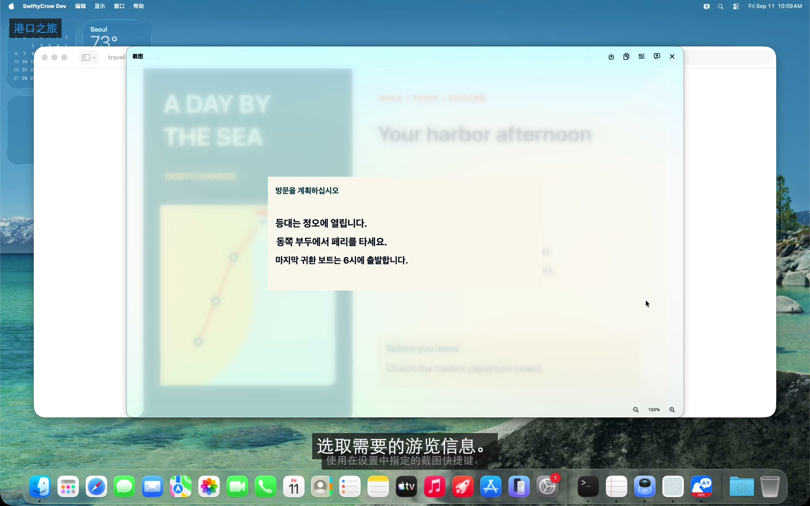
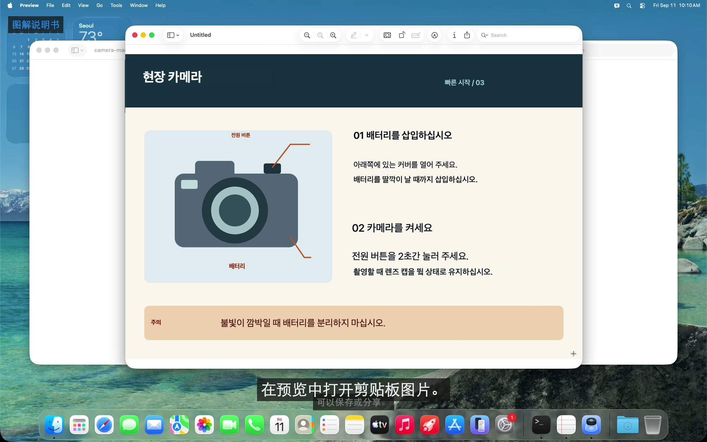
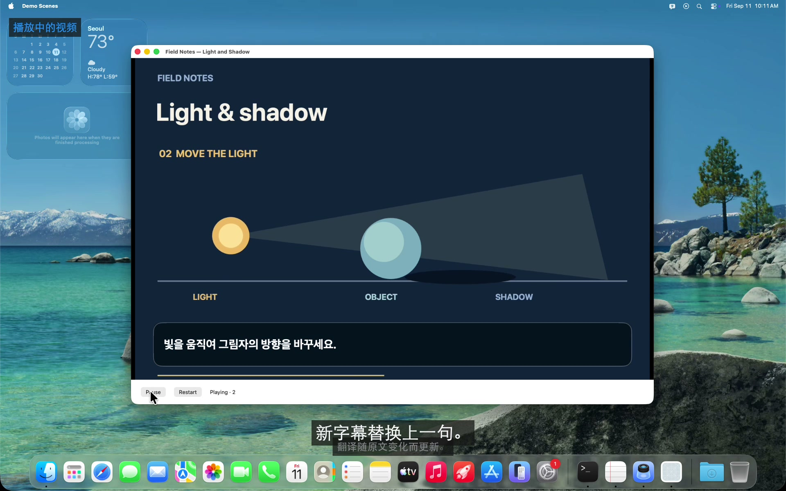
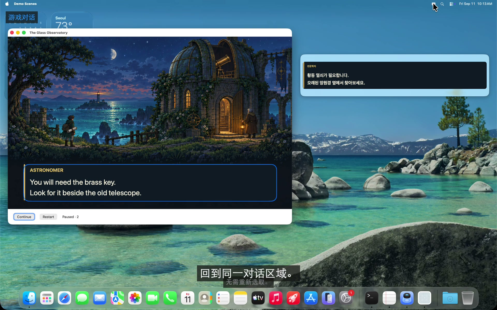
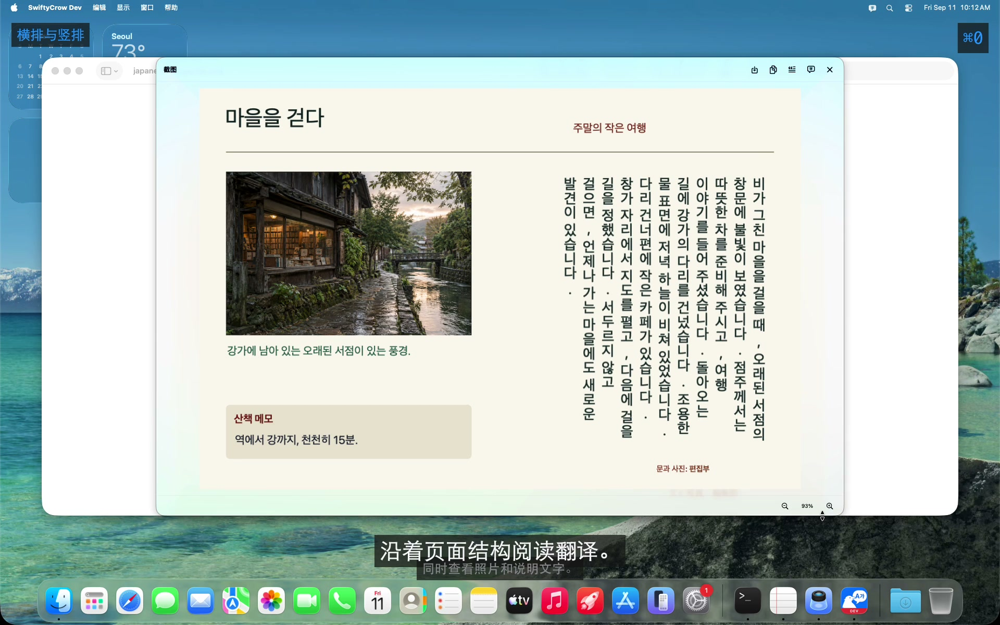

<!-- LANGUAGE-LINKS:START -->
[English](../../README.md) · [한국어](../ko/README.md) · [日本語](../ja/README.md) · [简体中文](README.md) · [繁體中文](../zh-Hant/README.md)
<!-- LANGUAGE-LINKS:END -->

<!--
SPDX-FileCopyrightText: 2021-2026 PangMo5 and contributors
SPDX-License-Identifier: MPL-2.0 OR AGPL-3.0-only
-->

<a id="swiftycrow"></a>
# SwiftyCrow 

[](https://github.com/PangMo5/SwiftyCrow/releases/latest) [](https://github.com/PangMo5/SwiftyCrow/releases)  [](../../LICENSE)

一款完全在本机处理的 macOS 屏幕翻译应用。

SwiftyCrow 能识别并翻译所选屏幕区域或窗口中的文字。截取静态图片，阅读并利用译文；也可以使用实时翻译，持续阅读不断变化的内容。识别与翻译使用 Mac 上的语言模型，无需云端 API 或账号。

<a id="see-swiftycrow-in-action"></a>
## 看看 SwiftyCrow 如何使用

[](https://swiftycrow.pangmo5.dev/zh-Hans/#demo-tour)

概览视频展示如何截取屏幕文字、翻译并将结果复制到笔记中。下方的功能视频分别演示图片复制、实时更新、独立翻译窗口和竖排文字识别。

<a id="why-swiftycrow"></a>
## 为什么选择 SwiftyCrow？

网页、图片或应用中的文字并不总能方便地选择和复制。SwiftyCrow 从屏幕读取文字，让你在查看原应用的同时翻译。

- **从屏幕翻译：** 直接选择相关区域，无需先保存文件或将文字移入其他应用。
- **选择合适的模式：** 用截图翻译一次屏幕内容，或用实时翻译持续阅读变化的文字。
- **利用翻译结果：** 保存或复制翻译后的图片，也可以只复制原文或译文。

<a id="features"></a>
## 主要功能

<a id="capture-and-reuse"></a>
### 截图后用于自己的工作

<a href="https://swiftycrow.pangmo5.dev/zh-Hans/#demo-capture"></a>

- **区域或窗口：** 拖动选择屏幕区域，或按**空格键**高亮并选择整个窗口。
- **截图翻译：** 在独立的结果窗口中阅读译文，同时保留图片及其布局。
- **缩放与适配：** 放大图片，或使其适配结果窗口。100% 时，一个截图像素对应一个屏幕像素。
- **保存与复制：** 保存为 PNG、复制翻译后的图片，或将识别的原文和译文复制为文字。无论如何缩放或平移，图片输出均保持完整截图的原始分辨率。

<br clear="right" />

<a id="follow-changing-content"></a>
### 跟随画面变化继续阅读

<a href="https://swiftycrow.pangmo5.dev/zh-Hans/#demo-live"></a>

- **持续翻译：** 选定一次区域或窗口，其中的文字变化时就会重新识别并翻译。
- **操作原应用：** 内容区域的点击和滚动会直接传递给下方的应用。
- **暂停与继续：** 使用 **实时** 按钮暂停或继续翻译，使用 **×** 关闭悬浮翻译。
- **记住所选区域：** 无需重新选择，即可显示或隐藏上次区域的翻译。隐藏时会停止截图和翻译；再次遇到相同文字时可复用之前的译文。

<br clear="right" />

<a id="keep-the-original-in-view"></a>
#### 对照原文阅读

<a href="https://swiftycrow.pangmo5.dev/zh-Hans/#demo-compare"></a>

- **显示方式：** 在原文上方显示翻译，或在旁边的独立窗口中阅读。
- **独立翻译窗口：** 在原应用旁阅读译文，不遮挡其内容。文字变化时，同一个翻译窗口会随之更新。

<br clear="right" />

<a id="read-images-and-documents"></a>
### 阅读图片和文档

<a href="https://swiftycrow.pangmo5.dev/zh-Hans/#demo-layout"></a>

- **阅读顺序：** 按阅读顺序识别竖排日文、中文和多栏文字。
- **文档结构：** 识别截取页面中的标题、正文、图片说明和边栏文字。
- **原文文字：** 直接复制识别出的文字，用于笔记或其他用途，无需手动抄写。

<br clear="right" />

<a id="languages-and-translation"></a>
### 语言与翻译

- **Mac 支持的语言：** 可选择 macOS 支持的源语言和目标语言。翻译前请下载所需模型。将源语言设为**自动检测**，即可逐行识别混合语言的内容。
- **两种翻译方式：** 选择**快速**以优先保证速度，或在运行 macOS 26.4 及以上版本的支持设备上选择**高质量**，使用 Apple Intelligence。

<a id="interface-and-settings"></a>
### 界面与设置

- **菜单栏控制：** 从菜单栏启动截图或实时翻译，并在设置中配置快捷键。
- **启动与更新：** 设置登录时启动，以及自动检查更新。
- **配置文件：** 应用内设置与 TOML 配置文件保持同步。

<a id="install"></a>
## 安装

需要 **macOS 26 或更高版本**。

**Homebrew**（推荐）：

```sh
brew install --cask PangMo5/tap/swiftycrow
```

**直接下载：** 从[发布页面](https://github.com/PangMo5/SwiftyCrow/releases/latest)获取最新的 `.dmg`，打开后将应用拖到“应用程序”文件夹。每个版本也提供对应源代码归档的链接。

首次启动时，快速设置会引导你允许屏幕录制、下载语言并完成首次截图。打开系统设置前会保存当前步骤和所选语言，因此即使 macOS 退出并重新打开应用，也能继续设置。还可在设置 → 通用 → 权限中查看当前状态。

<a id="usage"></a>
## 使用方法

1. 在设置（`⌘,`）中选择**源语言**和**目标语言**。
2. **截取区域：** 从弹出面板或快捷键启动**截图翻译**，然后拖过文字。也可按**空格键**高亮并点击整个窗口。拖动预览的标题区域可移动窗口。使用 `⌘+` / `⌘−` 缩放，点击百分比或按 `⌘0` 适配窗口；100% 表示一个图片像素对应一个屏幕像素。预览支持 `⌘S` 保存、`⌘C` 复制图片、`⌘O` 复制原文、`⌘T` 复制译文，以及 `Esc` 关闭。保存和复制始终包含原始分辨率的完整图片，与缩放或平移无关。
3. **使用实时翻译：** 点击**实时翻译**按钮选择区域或窗口，再次点击可选择新区域。旁边的**显示悬浮翻译**开关控制所选区域的显示和隐藏；选择区域前处于停用状态。使用悬浮翻译中的 **实时** 暂停或继续，使用 `⌘C` 复制完整译文，使用 **×** 关闭。
4. **显示或隐藏翻译：** **显示悬浮翻译**开关控制所选区域的翻译。隐藏时停止截图和翻译，再次显示时在同一区域继续。

截图、实时翻译和保存、复制操作的快捷键，可在设置 → 快捷键中修改。

<a id="troubleshooting"></a>
## 故障排查

<a id="unable-to-translate-or-a-missing-model-hint"></a>
### 翻译失败或提示缺少模型

SwiftyCrow 使用 Apple 的设备端翻译框架，需要先安装对应语言的模型。如果翻译失败或提示**语言模型尚未安装**，通常是因为检测到的语言模型还未下载。

**安装翻译模型：**

1. 打开**系统设置** → **通用** → **语言与地区**。
2. 向下滚动并选择**翻译语言…**。
3. 为源语言和目标语言**分别**点击**下载**。使用**自动检测**时，请安装截图中可能出现的所有语言。
4. 重新启动 SwiftyCrow 后再试。

应用中的**打开设置**按钮可直接跳转到相应设置。不再需要提醒时可选择**不再显示**。模型由 macOS 管理并保存在本机；可在同一面板删除不用的模型以释放空间。

详情请参阅 [docs/LANGUAGE_MODELS.md](LANGUAGE_MODELS.md)。

<a id="configuration"></a>
## 配置

设置保存在 `~/.config/SwiftyCrow/config.toml`，按应用的设置页分为 `[languages]`、`[overlay]`、`[shortcuts]`、`[translation]` 和 `[updates]` 表。应用内的修改与手动编辑文件的更改会保持同步。

所有键、默认值和快捷键语法请查看 [docs/CONFIGURATION.md](CONFIGURATION.md)。

<a id="development"></a>
## 开发

<a id="requirements"></a>
### 环境要求

- Xcode 26.4 或更高版本，包含 Swift 6.3 和 macOS 26.4 或更新的 SDK
- [mise](https://mise.jdx.dev)（通过 `.mise.toml` 管理 Tuist）
- 另行安装 SwiftFormat，用于源码格式化

<a id="building-from-source"></a>
### 从源码构建

```sh
export TUIST_DEVELOPMENT_TEAM=YOUR_TEAM_ID
export TUIST_SPARKLE_PUBLIC_ED_KEY=YOUR_SPARKLE_PUBLIC_KEY
mise install               # installs Tuist
tuist install              # resolves SPM dependencies
tuist generate             # generates the Xcode workspace
open SwiftyCrow.xcworkspace
```

Debug 构建使用 Apple Development 签名。请将 `TUIST_DEVELOPMENT_TEAM` 设为开发证书所属的团队。保持签名一致，可让 macOS 在重新构建后继续保留屏幕录制授权。将这些值写入 shell 配置或本地 `.mise.local.toml`：

```toml
[env]
TUIST_DEVELOPMENT_TEAM     = "YOUR_TEAM_ID"
TUIST_SPARKLE_PUBLIC_ED_KEY = "YOUR_SPARKLE_PUBLIC_KEY"
```

`TUIST_SPARKLE_PUBLIC_ED_KEY` 提供生成项目时写入 `Info.plist` 的公开验证密钥。该密钥必须有效，并与更新源的签名密钥匹配。使用官方更新源时，请使用发布版应用 `Contents/Info.plist` 中的 `SUPublicEDKey`。分支版本需要自己的更新源及匹配的公钥。

<a id="localization-and-site-previews"></a>
### 本地化与网站预览

术语和写作风格请遵循 [docs/LOCALIZATION.md](../LOCALIZATION.md)。应用目录、文档和网站使用相同的五种语言，每次构建应用前都会检查生成文件与目录是否一致。

```sh
swift run --package-path Tools swiftycrow-tools check
swift run --package-path Tools swiftycrow-tools docs
swift run --package-path Tools swiftycrow-tools site --output DerivedData/Site
swift run --package-path Tools swiftycrow-tools serve --output DerivedData/Site --port 8085
```

<a id="tech-stack"></a>
### 技术栈

- 由 **Tuist** 生成的工作区（`Project.swift`、`Tuist/Package.swift`）
- 使用 **TCA**（`swift-composable-architecture`）管理应用和截图状态，通过 `@DependencyClient` 注入依赖。
- 通过 **swift-sharing** 的 `fileStorage` 方式连接 **swift-toml**。
- 使用 **Magnet** 注册全局快捷键，并提供一个小型自定义快捷键录入控件。
- 应用内更新使用 **Sparkle**。
- 使用 **Apple Vision** 识别文字、**Apple 翻译**进行翻译、**ScreenCaptureKit** 截取屏幕。
- 使用 `.swiftformat` 中的 [Airbnb SwiftFormat](https://github.com/airbnb/swift) 配置统一源码格式。

<a id="license"></a>
## 许可证

[GNU Affero General Public License v3.0 only](../../LICENSE) (`AGPL-3.0-only`). Copyright (C) 2021-2026 PangMo5.

分发修改后的版本时，必须以相同许可证提供对应的源代码。第 13 条还要求通过网络使用的修改版向远程用户提供对应源代码。

本 README 和 `docs/LANGUAGE_MODELS.md` 包含此前以 MPL-2.0 提交的文档贡献，按文件中的说明，仍可选择 [MPL-2.0](https://www.mozilla.org/MPL/2.0/) 或 AGPL-3.0-only 使用。项目于 2021 年采用 MIT 许可证，2026 年先转为 MPL-2.0，再转为 AGPL-3.0-only。

所用软件包的许可证和确切源码修订记录在 [THIRD_PARTY_NOTICES.md](../../THIRD_PARTY_NOTICES.md) 中。该文件和许可证均包含在发布的应用包内。
