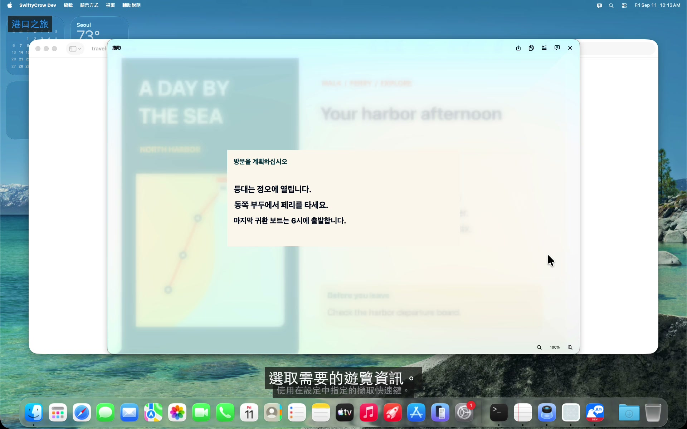
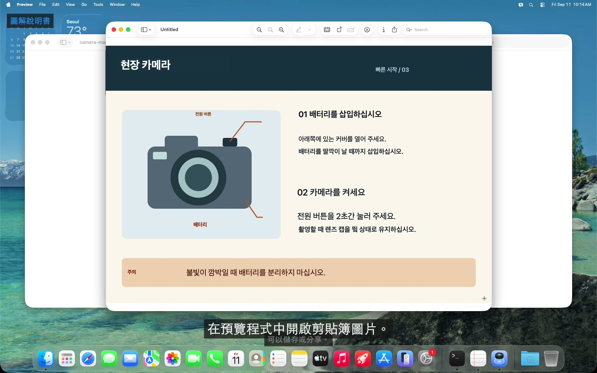
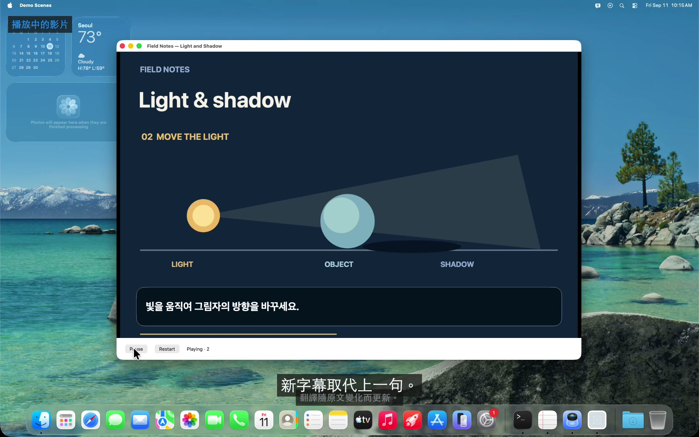
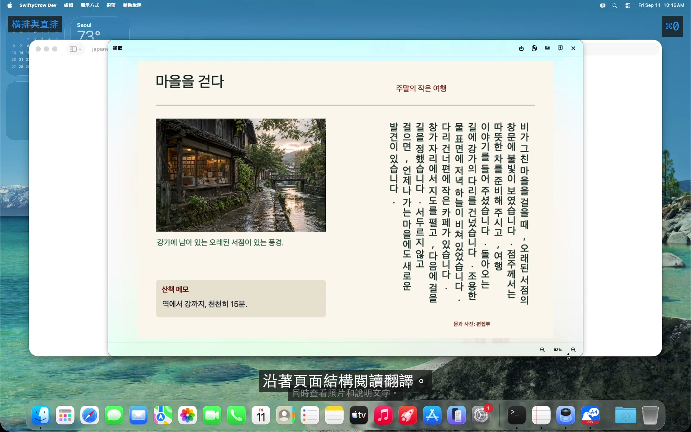
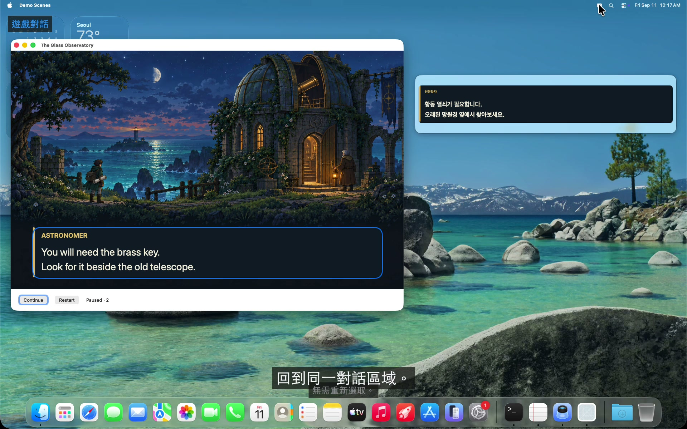

<!-- LANGUAGE-LINKS:START -->
[English](../../README.md) · [한국어](../ko/README.md) · [日本語](../ja/README.md) · [简体中文](../zh-Hans/README.md) · [繁體中文](README.md)
<!-- LANGUAGE-LINKS:END -->

<!--
SPDX-FileCopyrightText: 2021-2026 PangMo5 and contributors
SPDX-License-Identifier: MPL-2.0 OR AGPL-3.0-only
-->

<a id="swiftycrow"></a>
# SwiftyCrow 

[](https://github.com/PangMo5/SwiftyCrow/releases/latest) [](https://github.com/PangMo5/SwiftyCrow/releases)  [](../../LICENSE)

這款螢幕翻譯 App 的所有處理都在 Mac 上完成。透過 [ScreenCaptureKit](https://developer.apple.com/documentation/screencapturekit) 擷取任意螢幕區域，以 [Vision](https://developer.apple.com/documentation/vision) 辨識文字，再透過 [Apple 翻譯](https://developer.apple.com/documentation/translation)進行翻譯。不需要雲端 API、金鑰或使用額度。

<a id="see-swiftycrow-in-action"></a>
## 看看 SwiftyCrow 如何使用

[](https://swiftycrow.pangmo5.dev/zh-Hant/#demo-tour)

規劃一趟港口之旅：翻譯旅遊指南並記入筆記，再用即時翻譯查看不斷變化的出發資訊。各功能示範分別展示圖解說明書、影片字幕、直排日文雜誌，以及獨立視窗中的遊戲對話。原創範例內容由真實開發版本翻譯成韓文，App 介面使用本指南的語言。

<a id="features"></a>
## 主要功能

這份 README 以 `main` 為準，包含尚未發布的變更。各版本提供的功能請查看[更新紀錄](CHANGELOG.md)。

<a id="capture-and-reuse"></a>
### 擷取後用於自己的工作



[觀看操作流程](https://swiftycrow.pangmo5.dev/zh-Hant/#demo-capture)

- **區域擷取：** 拖移選取螢幕區域，或按 **Space**，像 macOS 螢幕截圖工具一樣選取整個視窗。結果會在浮動視窗中顯示，譯文直接顯示在原文位置。支援儲存或複製影像，也能單獨複製原文或譯文。

<br clear="right" />

<a id="follow-changing-content"></a>
### 跟隨畫面變化繼續閱讀



[觀看操作流程](https://swiftycrow.pangmo5.dev/zh-Hant/#demo-live)

- **即時翻譯：** 用相同方式選取目標，內容變更時會持續翻譯。本文區域內的點按與捲動會傳遞給下方 App。**即時**按鈕可暫停或繼續，**×**可關閉。譯文可顯示在**原文上**，也能放到**獨立視窗**，原位置僅保留區域邊框。
- **預設區域，隨需翻譯：** App 會記住上次區域，使用**顯示或隱藏即時翻譯**即可在相同位置切換翻譯。適合遊戲面板或固定位置的資訊。隱藏後會停止所有擷取與翻譯，直到再次顯示。
- **重複使用即時翻譯：** 再次查看相同文字時，會重複使用先前的翻譯結果。

<br clear="right" />

<a id="read-images-and-documents"></a>
### 閱讀圖片與文件



[觀看操作流程](https://swiftycrow.pangmo5.dev/zh-Hant/#demo-layout)

- **辨識文件結構：** 依閱讀順序辨識直排日文、中文與多欄文字，並依譯文語言選擇合適的書寫方向。
- **Mac 支援的語言：** 可選擇 macOS 支援的原文語言與翻譯語言。翻譯前請下載所需模型。將原文語言設為**自動偵測**，即可逐行辨識混合語言的內容。
- **兩種翻譯方式：** 選擇**快速**以速度優先，或在執行 macOS 26.4 以上版本的支援裝置上選擇**高品質**，使用 Apple Intelligence。

<br clear="right" />

<a id="keep-the-original-in-view"></a>
### 對照原文閱讀



[觀看操作流程](https://swiftycrow.pangmo5.dev/zh-Hant/#demo-compare)

- **選擇閱讀位置：** 在原文上顯示譯文，或在獨立視窗中閱讀，保留完整畫面。隱藏翻譯後，不必重新選取區域即可回到原本的位置。
- **常駐選單列：** 點按選單列圖示開啟控制面板，或按 `⌘,` 開啟設定。
- **自訂快速鍵：** 在設定 → 快速鍵中配置擷取、即時翻譯、上次區域的顯示與隱藏、暫停與繼續、顯示方式，以及儲存和複製操作。
- **登入時啟動：** 登入後自動啟動 SwiftyCrow。
- **直接編輯設定檔：** 可手動編輯與 App 內設定保持同步的文字檔。

<br clear="right" />

<a id="install"></a>
## 安裝

需要 **macOS 26 或以上版本**。

**Homebrew**（建議）：

```sh
brew install --cask PangMo5/tap/swiftycrow
```

**直接下載：** 從[發布頁面](https://github.com/PangMo5/SwiftyCrow/releases/latest)取得最新的 `.dmg`，開啟後將 App 拖到「應用程式」檔案夾。每個版本也提供對應原始碼封存檔的連結。

首次啟動時，請在系統設定 → 隱私權與安全性中允許**螢幕錄製**，再重新啟動 App。之後可透過 App 取得更新。

<a id="usage"></a>
## 使用方式

1. 在設定（`⌘,`）中選擇**原文語言**與**翻譯語言**。
2. **擷取區域：** 從控制面板或快速鍵啟動**擷取區域**，再拖移框選文字。按 **Space** 可選取整個視窗。拖移結果視窗的標題區域即可移動視窗。用 `⌘+` / `⌘−` 縮放，點按百分比或按 `⌘0` 讓影像配合視窗；100% 表示一個影像像素對應一個螢幕像素。`⌘S` 儲存、`⌘C` 複製影像、`⌘O` 複製原文、`⌘T` 複製譯文、`Esc` 關閉。無論目前縮放比例或平移位置為何，儲存與複製都會包含原始解析度的完整影像。
3. **使用即時翻譯：** 從選單列或快速鍵啟動**即時翻譯…**，拖移選取區域，或按 **Space** 選取視窗。**即時**按鈕可暫停或繼續，`⌘C` 可複製全部譯文，**×**可關閉。
4. **重複使用固定區域：** 選定區域後，使用**顯示或隱藏即時翻譯**即可在相同位置切換。隱藏後會停止所有擷取與翻譯。

擷取、即時翻譯及儲存、複製操作的快速鍵，可在設定 → 快速鍵中修改。

<a id="troubleshooting"></a>
## 疑難排解

<a id="unable-to-translate-or-a-missing-model-hint"></a>
### 翻譯失敗或提示缺少模型

SwiftyCrow 使用 Apple 的裝置端翻譯框架，需要先安裝對應語言的模型。如果翻譯失敗或提示**語言模型尚未安裝**，通常是因為偵測到的語言模型還未下載。

**安裝翻譯模型：**

1. 開啟**系統設定** → **一般** → **語言與地區**。
2. 向下捲動並選擇**翻譯語言…**。
3. 為原文語言與翻譯語言**分別**點按**下載**。使用**自動偵測**時，請安裝擷取內容中可能出現的所有語言。
4. 重新啟動 SwiftyCrow 後再試。

App 中的**開啟設定**按鈕可直接前往對應設定。不再需要提醒時可選擇**不再顯示**。模型由 macOS 管理並儲存在本機；可在相同面板刪除不用的模型以釋出空間。

詳細資訊請參閱 [docs/LANGUAGE_MODELS.md](LANGUAGE_MODELS.md)。

<a id="configuration"></a>
## 設定

設定儲存在 `~/.config/SwiftyCrow/config.toml`，依 App 的設定頁分為 `[languages]`、`[overlay]`、`[shortcuts]`、`[translation]` 和 `[updates]` 資料表。App 內的修改與手動編輯檔案的變更會保持同步。

所有鍵、預設值與快速鍵語法請查看 [docs/CONFIGURATION.md](CONFIGURATION.md)。

<a id="development"></a>
## 開發

<a id="requirements"></a>
### 環境需求

- Xcode 26.4 或以上版本，包含 Swift 6.3 與 macOS 26.4 或更新的 SDK
- [mise](https://mise.jdx.dev)（透過 `.mise.toml` 管理 Tuist）
- 另行安裝 SwiftFormat，用於原始碼格式化

<a id="building-from-source"></a>
### 從原始碼建置

```sh
export TUIST_DEVELOPMENT_TEAM=YOUR_TEAM_ID
export TUIST_SPARKLE_PUBLIC_ED_KEY=YOUR_SPARKLE_PUBLIC_KEY
mise install               # installs Tuist
tuist install              # resolves SPM dependencies
tuist generate             # generates the Xcode workspace
open SwiftyCrow.xcworkspace
```

Debug 建置使用 Apple Development 簽章。請將 `TUIST_DEVELOPMENT_TEAM` 設為開發憑證所屬的團隊。保持簽章一致，可讓 macOS 在重新建置後繼續保留螢幕錄製授權。將這些值寫入 shell 設定或本機 `.mise.local.toml`：

```toml
[env]
TUIST_DEVELOPMENT_TEAM     = "YOUR_TEAM_ID"
TUIST_SPARKLE_PUBLIC_ED_KEY = "YOUR_SPARKLE_PUBLIC_KEY"
```

`TUIST_SPARKLE_PUBLIC_ED_KEY` 提供產生專案時寫入 `Info.plist` 的公開驗證金鑰。金鑰必須有效，並與更新來源的簽章金鑰相符。使用官方更新來源時，請使用發布版 App `Contents/Info.plist` 中的 `SUPublicEDKey`。分支版本需要自己的更新來源與相符的公開金鑰。

<a id="localization-and-site-previews"></a>
### 在地化與網站預覽

術語與寫作風格請遵循 [docs/LOCALIZATION.md](../LOCALIZATION.md)。App 目錄、文件與網站使用相同的五種語言，每次建置 App 前都會檢查產生檔案與目錄是否一致。

```sh
swift run --package-path Tools swiftycrow-tools check
swift run --package-path Tools swiftycrow-tools docs
swift run --package-path Tools swiftycrow-tools site --output DerivedData/Site
swift run --package-path Tools swiftycrow-tools serve --output DerivedData/Site --port 8085
```

<a id="tech-stack"></a>
### 技術組成

- 由 **Tuist** 產生的工作空間（`Project.swift`、`Tuist/Package.swift`）
- 使用 **TCA**（`swift-composable-architecture`）管理 App 與擷取狀態，透過 `@DependencyClient` 注入相依項目。
- 透過 **swift-sharing** 的 `fileStorage` 方式連接 **swift-toml**。
- 使用 **Magnet** 註冊全域快速鍵，並提供小型自訂快速鍵輸入控制項。
- App 內更新使用 **Sparkle**。
- 使用 **Apple Vision** 辨識文字、**Apple 翻譯**進行翻譯、**ScreenCaptureKit** 擷取螢幕。
- 使用 `.swiftformat` 中的 [Airbnb SwiftFormat](https://github.com/airbnb/swift) 設定統一原始碼格式。

<a id="license"></a>
## 授權條款

[GNU Affero General Public License v3.0 only](../../LICENSE) (`AGPL-3.0-only`). Copyright (C) 2021-2026 PangMo5.

散布修改後的版本時，必須以相同授權條款提供對應的原始碼。第 13 條也要求透過網路使用的修改版向遠端使用者提供對應原始碼。

這份 README 與 `docs/LANGUAGE_MODELS.md` 包含先前以 MPL-2.0 提交的文件貢獻，依檔案中的說明，仍可選擇 [MPL-2.0](https://www.mozilla.org/MPL/2.0/) 或 AGPL-3.0-only 使用。專案於 2021 年採用 MIT 授權條款，2026 年先改為 MPL-2.0，再改為 AGPL-3.0-only。

使用的套件授權條款與確切原始碼修訂記錄在 [THIRD_PARTY_NOTICES.md](../../THIRD_PARTY_NOTICES.md) 中。此檔案與授權條款均包含在發布的 App 套件內。
